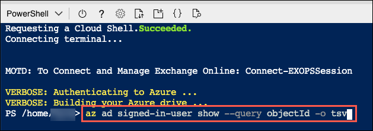
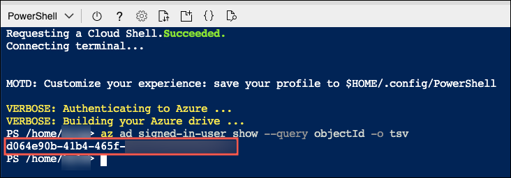
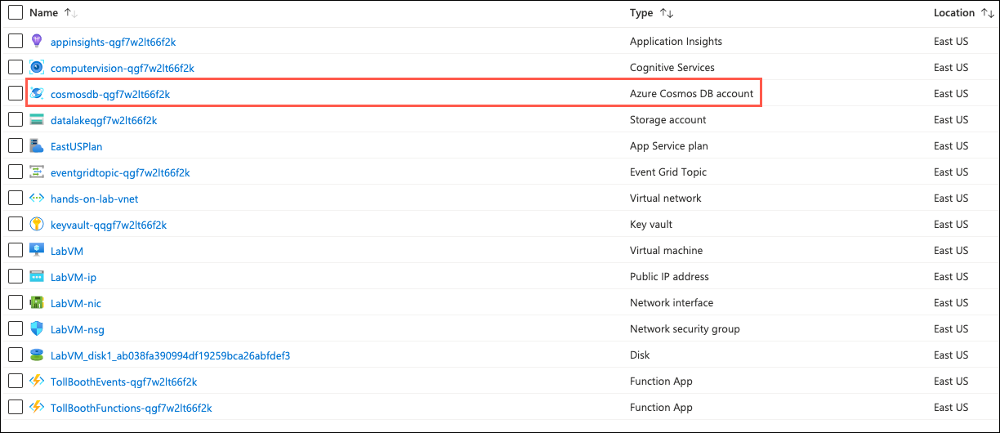
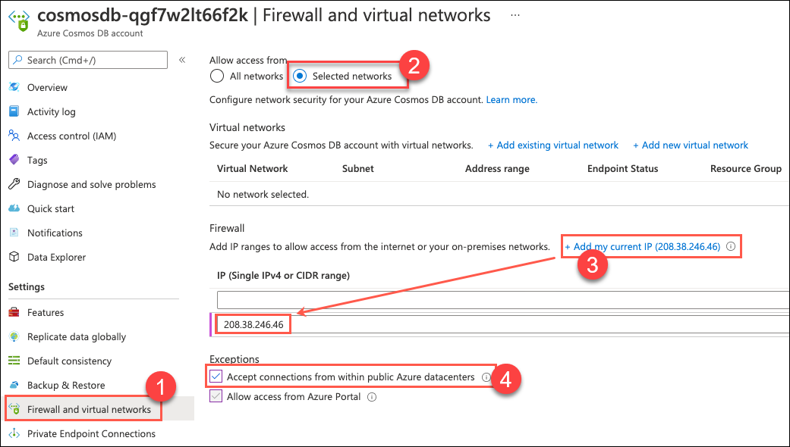
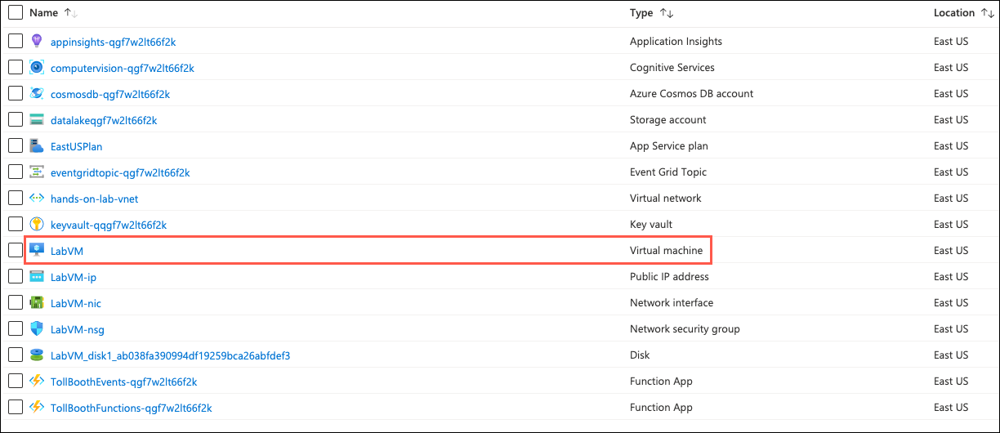
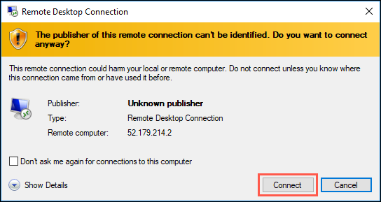
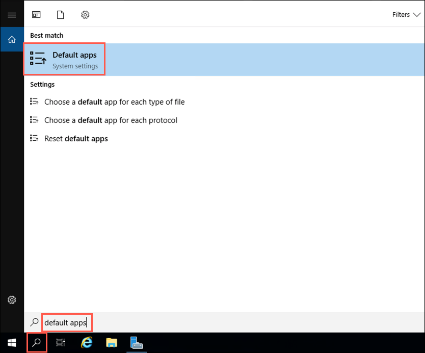
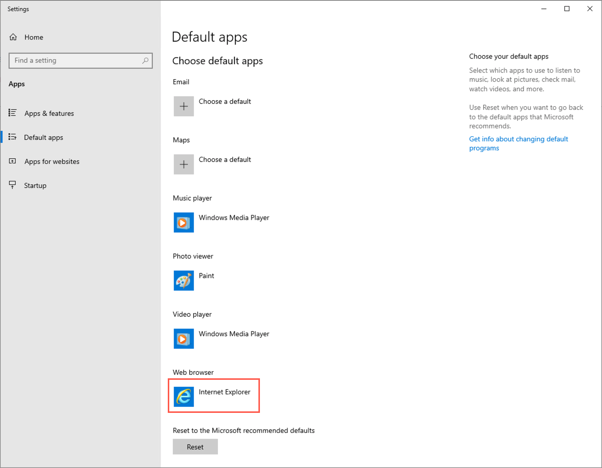
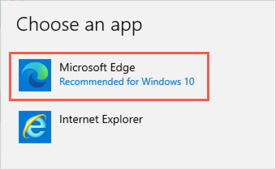

<div class="MCWHeader1">
Serverless architecture
</div>

<div class="MCWHeader2">
Before the hands-on lab setup guide
</div>

<div class="MCWHeader3">
April 2021
</div>

Information in this document, including URL and other Internet Web site references, is subject to change without notice. Unless otherwise noted, the example companies, organizations, products, domain names, e-mail addresses, logos, people, places, and events depicted herein are fictitious, and no association with any real company, organization, product, domain name, e-mail address, logo, person, place or event is intended or should be inferred. Complying with all applicable copyright laws is the responsibility of the user. Without limiting the rights under copyright, no part of this document may be reproduced, stored in or introduced into a retrieval system, or transmitted in any form or by any means (electronic, mechanical, photocopying, recording, or otherwise), or for any purpose, without the express written permission of Microsoft Corporation.

Microsoft may have patents, patent applications, trademarks, copyrights, or other intellectual property rights covering subject matter in this document. Except as expressly provided in any written license agreement from Microsoft, the furnishing of this document does not give you any license to these patents, trademarks, copyrights, or other intellectual property.

The names of manufacturers, products, or URLs are provided for informational purposes only and Microsoft makes no representations and warranties, either expressed, implied, or statutory, regarding these manufacturers or the use of the products with any Microsoft technologies. The inclusion of a manufacturer or product does not imply endorsement of Microsoft of the manufacturer or product. Links may be provided to third party sites. Such sites are not under the control of Microsoft and Microsoft is not responsible for the contents of any linked site or any link contained in a linked site, or any changes or updates to such sites. Microsoft is not responsible for webcasting or any other form of transmission received from any linked site. Microsoft is providing these links to you only as a convenience, and the inclusion of any link does not imply endorsement of Microsoft of the site or the products contained therein.

© 2021 Microsoft Corporation. All rights reserved.

**Contents**

- [Serverless architecture before the hands-on lab setup guide](#serverless-architecture-before-the-hands-on-lab-setup-guide)
  - [Requirements](#requirements)
  - [Before the hands-on lab](#before-the-hands-on-lab)
    - [Task 1: Create a resource group](#task-1-create-a-resource-group)
    - [Task 2: Run ARM template to provision lab resources](#task-2-run-arm-template-to-provision-lab-resources)
    - [Task 3: Add your IP address to the Cosmos DB firewall](#task-3-add-your-ip-address-to-the-cosmos-db-firewall)
    - [Task 4: Set the default web browser to Microsoft Edge on the Lab VM](#task-4-set-the-default-web-browser-to-microsoft-edge-on-the-lab-vm)

# Serverless architecture before the hands-on lab setup guide

## Requirements

- Microsoft Azure subscription (non-Microsoft subscription)
- Office 365 account. If required, you can sign up for an Office 365 trial at:
  - <https://portal.office.com/Signup/MainSignup15.aspx?Dap=False&QuoteId=79a957e9-ad59-4d82-b787-a46955934171&ali=1>
- GitHub account. You can [create a free account](https://github.com/join?ref_cta=Sign+up&ref_loc=header+logged+out&ref_page=%2F&source=header-home) at <https://github.com>.

## Before the hands-on lab

**Duration**: 20 minutes

In this exercise, you set up your environment for use in the rest of the hands-on lab. You should follow all steps provided _before_ attending the hands-on lab.

> **Important**: Many Azure resources require globally unique names. Throughout these steps, the word "SUFFIX" appears as part of resource names. You should replace this with your Microsoft alias, initials, or another value to ensure uniquely named resources.

### Task 1: Create a resource group

1. In the [Azure portal](https://portal.azure.com), select **Resource groups** from the Azure services list.

   

2. On the Resource groups blade, select **+Add**.

   

3. On the Create a resource group **Basics** tab, enter the following:

   - **Subscription**: Select the subscription you are using for this hands-on lab.
   - **Resource group**: Enter `hands-on-lab-SUFFIX` as the name of the new resource group.
   - **Region**: Select the region you are using for this hands-on lab.

   

4. Select **Review + Create**.

5. On the **Review + create** tab, ensure the Validation passed message is displayed and then select **Create**.

### Task 2: Run ARM template to provision lab resources

In this task, you run an Azure Resource Manager (ARM) template to create the hands-on lab's resources. In addition to creating resources, the ARM template also executes a PowerShell script on the `LabVM` to install software and configure the server. The resources created by the ARM template include:

- Azure Data Lake Storage Gen2 account
  - Blob and File services
  - Containers named `images` and `export`
- Azure Cosmos DB
  - Database named `LicensePlates`
  - Containers named `Processed` and `NeedsManualReview`
- Virtual network with `default` subnet
- Virtual machine using the Visual Studio 2019 (Latest) Community Edition image
  - Uses custom script extension to
    - Install Microsoft Edge browser
    - Download starter solution from Serverless architecture MCW GitHub repo
    - Disable **IE Enhanced Security Configuration**
- Network security group for VM
- Network interface for VM
- Public IP address for VM
- Azure Function Apps
  - `TollBoothFunctions`
  - `TollBoothEvents`
- Application Insights
- Azure Computer Vision service
- Azure Event Grid Topic
- Azure Logic App
- Azure Key Vault plus secrets for:
  - `computerVisionApiKey`
  - `cosmosDBAuthorizationKey`
  - `dataLakeConnectionString`
  - `eventGridTopicKey`

> **Note**: You can review the steps to manually provision and configure the lab resources in the [Manual resource setup guide](./Manual-resource-setup.md).

1. You are now ready to begin the ARM template deployment. To open a custom deployment screen in the Azure portal, select the Deploy to Azure button below:

   <a href ="https://portal.azure.com/#create/Microsoft.Template/uri/https%3A%2F%2Fraw.githubusercontent.com%2Fmicrosoft%2FMCW-Serverless-architecture%2Fmaster%2FHands-on%20lab%2Flab-files%2Farm-template%2Fazure-deploy.json" target="_blank" title="Deploy to Azure">
      
   </a>

2. On the custom deployment screen, the first parameter you need to populate is the `ObjectId` associated with the account you used to log into the Azure portal. To retrieve this, select the **Cloud Shell** icon on the Azure portal toolbar to open an Azure command line interface (CLI) terminal window at the bottom of your open browser window.

   

3. In the PowerShell terminal window that opens in the Azure portal, enter the following command at the prompt:

   ```powershell
   az ad signed-in-user show --query objectId -o tsv
   ```

   

4. Execute the command and copy the output value.

   

5. Now, on the custom deployment screen in the Azure portal, enter the following:

   - **Subscription**: Select the subscription you are using for this hands-on lab.
   - **Resource group**: Select the hands-on-lab-SUFFIX resource group from the dropdown list.
   - **Signed In User Object Id**: Paste the value you copied above from the cloud shell terminal command output.
   - **Vm Username**: Accept the default value, **demouser**.
   - **Vm Password**: Accept the default value, **Password.1!!**.

   

6. Select **Review + create** to review the custom deployment.

   > **Note**: The ARM template will append a hyphen followed by a 13-digit string at the end of resource names. This suffix ensures globally unique names for resources. We will ignore that string when referring to resources throughout the lab.

7. On the Review + create blade, ensure the _Validation passed_ message is displayed and then select **Create** to begin the custom deployment.

   > **Note**: The deployment of the custom ARM template should finish in about 5 minutes.

   

8. You can monitor the deployment's progress on the **Deployment** blade that opens when you start the ARM template deployment.

### Task 3: Add your IP address to the Cosmos DB firewall

1. In the [Azure portal](https://portal.azure.com), navigate to the **hands-on-lab-SUFFIX** resource group you created above.

   > You can get to the resource group by selecting **Resource groups** under **Azure services** on the Azure portal home page and then select the resource group from the list. If there are many resource groups in your Azure account, you can filter the list for **hands-on-lab** to reduce the resource groups listed.

2. On your resource group blade, select the **cosmosdb** Azure Cosmos DB account resource in the resource group's list of services available.

   

3. Next, select **Firewall and virtual networks** in the left-hand navigation menu of the Cosmos DB blade.

4. Select **+ Add my current IP** to add your IP address to the IP list under Firewall. Next, check the box next to **Accept connections from within public Azure datacenters**. Checking this box enables Azure services, such as your Function Apps, to access your Azure Cosmos DB account.

    

5. Select **Save**.

### Task 4: Set the default web browser to Microsoft Edge on the Lab VM

In this task, you create an RDP connection to your Lab virtual machine (VM) and change the default web browser to Microsoft Edge. This will ensure Microsoft Edge is used when launching a web browser from Visual Studio and prevent the functionality issues encountered if using Internet Explorer.

1. In the [Azure portal](https://portal.azure.com), select **Resource groups** from the Azure services list.

   

2. Select the **hands-on-lab-SUFFIX** resource group from the list.

   

3. In the list of resources within your resource group, select the **LabVM Virtual machine** resource.

   

4. On your LabVM blade, select **Connect** and **RDP** from the top menu.

   

5. On the Connect to virtual machine blade, select **Download RDP File**, then open the downloaded RDP file.

   

6. Select **Connect** on the Remote Desktop Connection dialog.

   

7. Enter the following credentials when prompted, and then select **OK**:

   - **User name**: demouser
   - **Password**: Password.1!!

   

8. Select **Yes** to connect if prompted that the remote computer's identity cannot be verified.

   

9. Once logged in, select the **Search** icon on the start bar, enter **default apps** into the search box, and select **Default apps** in the search results.

    

10. In the Default apps dialog, select **Internet Explorer** under **Web browser**.

    

11. In the **Choose an app** dialog, select **Microsoft Edge**.

    

12. Close the **Default apps** dialog.

You should follow all steps provided *before* performing the Hands-on lab.

