<div class="MCWHeader1">
Serverless architecture
</div>

<div class="MCWHeader2">
Hands-on lab step-by-step
</div>

<div class="MCWHeader3">
June 2020
</div>

Information in this document, including URL and other Internet Web site references, is subject to change without notice. Unless otherwise noted, the example companies, organizations, products, domain names, e-mail addresses, logos, people, places, and events depicted herein are fictitious, and no association with any real company, organization, product, domain name, e-mail address, logo, person, place or event is intended or should be inferred. Complying with all applicable copyright laws is the responsibility of the user. Without limiting the rights under copyright, no part of this document may be reproduced, stored in or introduced into a retrieval system, or transmitted in any form or by any means (electronic, mechanical, photocopying, recording, or otherwise), or for any purpose, without the express written permission of Microsoft Corporation.

Microsoft may have patents, patent applications, trademarks, copyrights, or other intellectual property rights covering subject matter in this document. Except as expressly provided in any written license agreement from Microsoft, the furnishing of this document does not give you any license to these patents, trademarks, copyrights, or other intellectual property.

The names of manufacturers, products, or URLs are provided for informational purposes only and Microsoft makes no representations and warranties, either expressed, implied, or statutory, regarding these manufacturers or the use of the products with any Microsoft technologies. The inclusion of a manufacturer or product does not imply endorsement of Microsoft of the manufacturer or product. Links may be provided to third party sites. Such sites are not under the control of Microsoft and Microsoft is not responsible for the contents of any linked site or any link contained in a linked site, or any changes or updates to such sites. Microsoft is not responsible for webcasting or any other form of transmission received from any linked site. Microsoft is providing these links to you only as a convenience, and the inclusion of any link does not imply endorsement of Microsoft of the site or the products contained therein.

© 2020 Microsoft Corporation. All rights reserved.

Microsoft and the trademarks listed at <https://www.microsoft.com/legal/intellectualproperty/Trademarks/Usage/General.aspx> are trademarks of the Microsoft group of companies. All other trademarks are property of their respective owners.

**Contents**

<!-- TOC -->

- [Serverless architecture hands-on lab step-by-step](#serverless-architecture-hands-on-lab-step-by-step)
  - [Abstract and learning objectives](#abstract-and-learning-objectives)
  - [Overview](#overview)
  - [Solution architecture](#solution-architecture)
  - [Requirements](#requirements)
  - [Exercise 1: Azure data, storage, and serverless environment setup](#exercise-1-azure-data-storage-and-serverless-environment-setup)
    - [Help references](#help-references)
    - [Task 1: Provision the storage account](#task-1-provision-the-storage-account)
    - [Task 2: Provision the Function Apps](#task-2-provision-the-function-apps)
    - [Task 3: Provision the Event Grid topic](#task-3-provision-the-event-grid-topic)
    - [Task 4: Provision the Azure Cosmos DB account](#task-4-provision-the-azure-cosmos-db-account)
    - [Task 5: Provision the Computer Vision API service](#task-5-provision-the-computer-vision-api-service)
    - [Task 6: Provision Azure Key Vault](#task-6-provision-azure-key-vault)
    - [Task 7: Retrieve the URI for each secret](#task-7-retrieve-the-uri-for-each-secret)
  - [Exercise 2: Develop and publish the photo processing and data export functions](#exercise-2-develop-and-publish-the-photo-processing-and-data-export-functions)
    - [Help references](#help-references-1)
    - [Task 1: Create a system-assigned managed identity for your Function App to connect to Key Vault](#task-1-create-a-system-assigned-managed-identity-for-your-function-app-to-connect-to-key-vault)
    - [Task 2: Configure application settings](#task-2-configure-application-settings)
    - [Task 3: Add Function App to Key Vault access policy](#task-3-add-function-app-to-key-vault-access-policy)
    - [Task 4: Finish the ProcessImage function](#task-4-finish-the-processimage-function)
    - [Task 5: Publish the Function App from Visual Studio](#task-5-publish-the-function-app-from-visual-studio)
  - [Exercise 3: Create functions in the portal](#exercise-3-create-functions-in-the-portal)
    - [Help references](#help-references-2)
    - [Task 1: Create function to save license plate data to Azure Cosmos DB](#task-1-create-function-to-save-license-plate-data-to-azure-cosmos-db)
    - [Task 2: Add an Event Grid subscription to the SavePlateData function](#task-2-add-an-event-grid-subscription-to-the-saveplatedata-function)
    - [Task 3: Add an Azure Cosmos DB output to the SavePlateData function](#task-3-add-an-azure-cosmos-db-output-to-the-saveplatedata-function)
    - [Task 4: Create function to save manual verification info to Azure Cosmos DB](#task-4-create-function-to-save-manual-verification-info-to-azure-cosmos-db)
    - [Task 5: Add an Event Grid subscription to the QueuePlateForManualCheckup function](#task-5-add-an-event-grid-subscription-to-the-queueplateformanualcheckup-function)
    - [Task 6: Add an Azure Cosmos DB output to the QueuePlateForManualCheckup function](#task-6-add-an-azure-cosmos-db-output-to-the-queueplateformanualcheckup-function)
  - [Exercise 4: Monitor your functions with Application Insights](#exercise-4-monitor-your-functions-with-application-insights)
    - [Help references](#help-references-3)
    - [Task 1: Provision an Application Insights instance](#task-1-provision-an-application-insights-instance)
    - [Task 2: Enable Application Insights integration in your Function Apps](#task-2-enable-application-insights-integration-in-your-function-apps)
    - [Task 3: Use the Live Metrics Stream to monitor functions in real time](#task-3-use-the-live-metrics-stream-to-monitor-functions-in-real-time)
    - [Task 4: Observe your functions dynamically scaling when resource-constrained](#task-4-observe-your-functions-dynamically-scaling-when-resource-constrained)
  - [Exercise 5: Explore your data in Azure Cosmos DB](#exercise-5-explore-your-data-in-azure-cosmos-db)
    - [Help references](#help-references-4)
    - [Task 1: Use the Azure Cosmos DB Data Explorer](#task-1-use-the-azure-cosmos-db-data-explorer)
  - [Exercise 6: Create the data export workflow](#exercise-6-create-the-data-export-workflow)
    - [Help references](#help-references-5)
    - [Task 1: Create the Logic App](#task-1-create-the-logic-app)
  - [Exercise 7: Configure continuous deployment for your Function App](#exercise-7-configure-continuous-deployment-for-your-function-app)
    - [Help references](#help-references-6)
    - [Task 1: Add git repository to your Visual Studio solution and deploy to GitHub](#task-1-add-git-repository-to-your-visual-studio-solution-and-deploy-to-github)
    - [Task 2: Configure your Function App to use your GitHub repository for continuous deployment](#task-2-configure-your-function-app-to-use-your-github-repository-for-continuous-deployment)
    - [Task 3: Finish your ExportLicensePlates function code and push changes to GitHub to trigger deployment](#task-3-finish-your-exportlicenseplates-function-code-and-push-changes-to-github-to-trigger-deployment)
  - [Exercise 8: Rerun the workflow and verify data export](#exercise-8-rerun-the-workflow-and-verify-data-export)
    - [Task 1: Run the Logic App](#task-1-run-the-logic-app)
    - [Task 2: View the exported CSV file](#task-2-view-the-exported-csv-file)
  - [After the hands-on lab](#after-the-hands-on-lab)
    - [Task 1: Delete the resource group in which you placed your Azure resources](#task-1-delete-the-resource-group-in-which-you-placed-your-azure-resources)
    - [Task 2: Delete the GitHub repo](#task-2-delete-the-github-repo)

<!-- /TOC -->

# Serverless architecture hands-on lab step-by-step

## Abstract and learning objectives

In this hand-on lab, you will be challenged to implement an end-to-end scenario using a supplied sample that is based on Microsoft Azure Functions, Azure Cosmos DB, Event Grid, and related services. The scenario will include implementing compute, storage, workflows, and monitoring, using various components of Microsoft Azure. The hands-on lab can be implemented on your own, but it is highly recommended to pair up with other members at the lab to model a real-world experience and to allow each member to share their expertise for the overall solution.

At the end of the hands-on-lab, you will have confidence in designing, developing, and monitoring a serverless solution that is resilient, scalable, and cost-effective.

## Overview

Contoso Ltd. is rapidly expanding their toll booth management business to operate in a much larger area. As this is not their primary business, which is online payment services, they are struggling with scaling up to meet the upcoming demand to extract license plate information from a large number of new tollbooths, using photos of vehicles uploaded to cloud storage. Currently, they have a manual process where they send batches of photos to a 3rd-party who manually transcodes the license plates to CSV files that they send back to Contoso to upload to their online processing system. They want to automate this process in a way that is cost effective and scalable. They believe serverless is the best route for them, but do not have the expertise to build the solution.

## Solution architecture

Below is a diagram of the solution architecture you will build in this lab. Please study this carefully, so you understand the whole of the solution as you are working on the various components.


The solution begins with vehicle photos being uploaded to an Azure Storage blobs container, as they are captured. An Event Grid subscription is created against the Blob storage create event, calling the photo processing **Azure Function** endpoint (on the side of the diagram), which in turn sends the photo to the **Cognitive Services Computer Vision API OCR** service to extract the license plate data. If processing was successful and the license plate number was returned, the function submits a new Event Grid event, along with the data, to an Event Grid topic with an event type called "savePlateData". However, if the processing was unsuccessful, the function submits an Event Grid event to the topic with an event type called "queuePlateForManualCheckup". Two separate functions are configured to trigger when new events are added to the Event Grid topic, each filtering on a specific event type, both saving the relevant data to the appropriate **Azure Cosmos DB** collection for the outcome, using the Cosmos DB output binding. A **Logic App** that runs on a 15-minute interval executes an Azure Function via its HTTP trigger, which is responsible for obtaining new license plate data from Cosmos DB and exporting it to a new CSV file saved to Blob storage. If no new license plate records are found to export, the Logic App sends an email notification to the Customer Service department via their Office 365 subscription. **Application Insights** is used to monitor all of the Azure Functions in real-time as data is being processed through the serverless architecture. This real-time monitoring allows you to observe dynamic scaling first-hand and configure alerts when certain events take place. **Azure Key Vault** is used to securely store secrets, such as connection strings and access keys. Key Vault is accessed by the Function Apps through an access policy within Key Vault, assigned to each Function App's system-assigned managed identity.

## Requirements

- Microsoft Azure subscription (non-Microsoft subscription).
- Local machine or a virtual machine configured with (**complete the day before the lab!**):
  - Visual Studio Community 2019 or greater.
    - <https://www.visualstudio.com/vs/>
  - Azure development workload for Visual Studio.
    - <https://docs.microsoft.com/azure/azure-functions/functions-develop-vs#prerequisites>
  - .NET Framework 4.7 runtime (or higher) and .NET Core 3.1 SDK.
    - <https://www.microsoft.com/net/download/windows>
- Office 365 account. If required, you can sign up for an Office 365 trial at:
  - <https://portal.office.com/Signup/MainSignup15.aspx?Dap=False&QuoteId=79a957e9-ad59-4d82-b787-a46955934171&ali=1>
- GitHub account. You can create a free account at <https://github.com>.

## Exercise 1: Azure data, storage, and serverless environment setup

**Duration**: 30 minutes

You must provision a few resources in Azure before you start developing the solution. Ensure all resources use the same resource group for easier cleanup.

In this exercise, you will provision a blob storage account using the Hot tier, and create two containers within to store uploaded photos and exported CSV files. You will then provision two Function Apps instances, one you will deploy from Visual Studio, and the other you will manage using the Azure portal. Next, you will create a new Event Grid topic. After that, you will create an Azure Cosmos DB account with two collections. Finally, you will provision a new Cognitive Services Computer Vision API service for applying object character recognition (OCR) on the license plates.

### Help references

|                                            |                                                                                                                                                       |
| ------------------------------------------ | :---------------------------------------------------------------------------------------------------------------------------------------------------: |
| **Description**                            |                                                                       **Links**                                                                       |
| Creating a storage account (blob hot tier) | <https://docs.microsoft.com/azure/storage/common/storage-create-storage-account?toc=%2fazure%2fstorage%2fblobs%2ftoc.json%23create-a-storage-account> |
| Creating a function app                    |                                <https://docs.microsoft.com/azure/azure-functions/functions-create-function-app-portal>                                |
| Concepts in Event Grid                     |                                                <https://docs.microsoft.com/azure/event-grid/concepts>                                                 |
| Creating an Azure Cosmos DB account        |                                              <https://docs.microsoft.com/azure/cosmos-db/manage-account>                                              |

### Task 1: Provision the storage account

1. Using a new tab or instance of your browser, navigate to the Azure portal, <http://portal.azure.com>.

2. If the left-hand menu is collapsed, select the menu button on the top-left corner of the portal to expand the menu.

    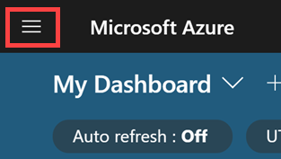

3. Select **+ Create a resource**, then select **Storage**, **Storage account**.

    

4. On the **Create storage account** blade, specify the following configuration options:

    a. For **Resource group**, select the **Use existing** radio button, and select the **ServerlessArchitecture** resource group.

    b. **Name**: enter a unique value for the storage account such as **tollboothstorage** (must be all lower case; ensure the green check mark appears).

    c. Ensure the **Location** selected is the same region as the resource group.

    d. For performance, ensure **Standard** is selected.

    e. For account kind, select **StorageV2 (general purpose v2)**.

    f. For replication, select **Locally-redundant storage (LRS)**.

    g. Select **Hot** for the access tier.

    

5. Select **Review + create**, then select **Create**.

6. After the storage account has completed provisioning, open the storage account by selecting **Go to resource**.

    

7. On the **Storage account** blade, select **Access Keys**, under Settings in the menu. Then on the **Access keys** blade, select the **Click to copy** button for **key1 connection string.**

    

8. Paste the value into a text editor, such as Notepad, for later reference.

9. Select **Containers** under **Blob Service** in the menu. Then select the **+ Container** button to add a new container. In the **Name** field, enter **images**, select **Private (no anonymous access)** for the public access level, then select **OK** to save.

    

10. Repeat these steps to create a container named **export**.

    

### Task 2: Provision the Function Apps

1. Navigate to the Azure portal, <http://portal.azure.com>.

2. Select **+ Create a resource**, then enter **function** into the search box on top. Select **Function App** from the results.

    

3. Select the **Create** button on the **Function App overview** blade.

4. Within the **Create Function App** *Basics* blade, specify the following configuration options:

    a. **Subscription**: Select your Azure subscription for this lab.

    b. **Resource Group**: Select **ServerlessArchitecture**.

    c. **Name**: Unique value for the App name (ensure the green check mark appears). Provide a name similar to **TollBoothFunctionApp**.

    d. **Publish**: Select **Code**.

    e. **Runtime stack**: Select **.NET Core**.

    f. **Version**: Select **3.1**.

    g. **Region**: Select the region you are using for this lab, or the closest available one.

    

5. Select **Next: Hosting >**.

6. Within the **Hosting** blade, specify the following configuration options:

    a. **Storage account**: Leave this option as **create new**.

    b. **Operating system**: Select **Windows**.

    c. **Plan type**: Select **Consumption (Serverless)**.

    

7. Select **Next: Monitoring >**.

    a. **Enable Application Insights**: Select **No** (we'll add this later).

    

8. Select **Review + create**, then select **Create** to provision the new Function App.

9. **Repeat steps 1-3** to create a second Function App.

10. Within the **Create Function App** blade *Basics* tab, specify the following configuration options:

    a. **Subscription**: Select your Azure subscription for this lab.

    b. **Resource Group**: Select **ServerlessArchitecture**.

    c. **Name**: Unique value for the App name (ensure the green check mark appears). Provide a name similar to **TollBoothEvents**.

    d. **Publish**: Select **Code**.

    e. **Runtime stack**: Select **Node.js**.

    f. **Version**: Select **12**.

    g. **Region**: Select the region you are using for this lab, or the closest available one.

    

11. Select **Next: Hosting >**.

12. Within the **Hosting** blade, specify the following configuration options:

    a. **Storage account**: Leave this option as **create new**.

    b. **Operating system**: Select **Windows**.

    c. **Plan type**: Select **Consumption**.

    

13. Select **Next: Monitoring >**.

    a. **Enable Application Insights**: Select **No** (we'll add this later).

    

14. Select **Review + create**, then select **Create** to provision the new Function App.

### Task 3: Provision the Event Grid topic

1. Navigate to the Azure portal, <http://portal.azure.com>.

2. Select **+ Create a resource**, then enter **event grid** into the search box on top. Select **Event Grid Topic** from the results.

    

3. Select the **Create** button on the **Event Grid Topic overview** blade.

4. On the **Create Topic** blade, specify the following configuration options:

    a. **Name:** Unique value for the App name such as **TollboothEventGrid** (ensure the green check mark appears).

    b. Select the Resource Group **ServerlessArchitecture**.

    c. Ensure the **Location** selected is set to the same region as your Resource Group.

    

5. Select **Next: Advanced >**.

6. Make sure **Event Grid Schema** is selected as the event schema.

    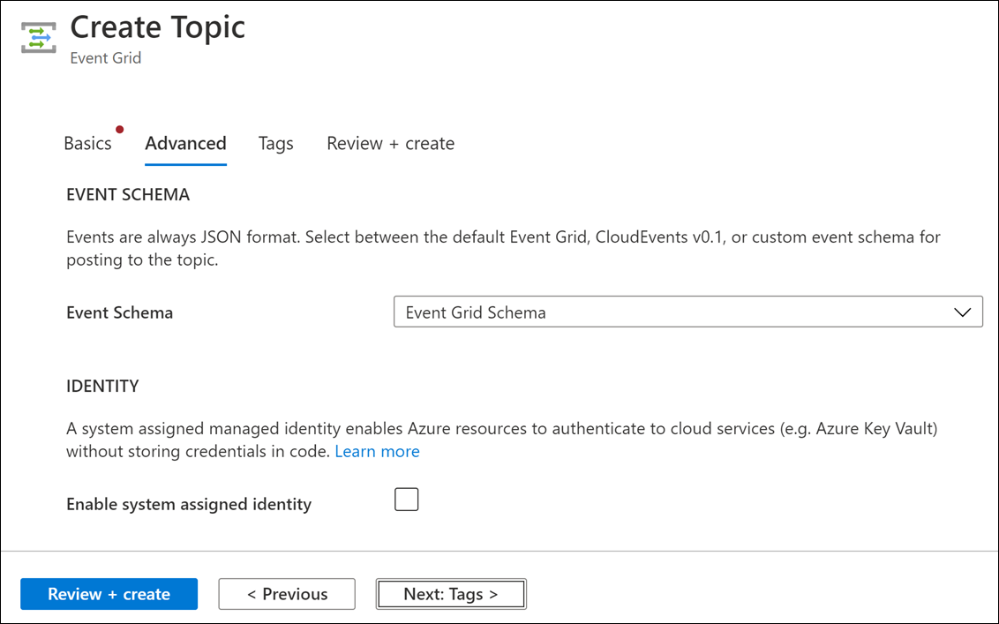

7. Select **Review + Create**, then select **Create** in the screen that follows.

8. After the Event Grid topic has completed provisioning, open the account by opening the **ServerlessArchitecture** resource group, and then selecting the **Event Grid** topic name.

7. Select **Overview** in the menu, and then copy the **Topic Endpoint** value.

    

8. Select **Access Keys** under Settings in the menu.

9. Within the **Access Keys** blade, copy the **Key 1** value.

    

10. Paste the values into a text editor, such as Notepad, for later reference.

### Task 4: Provision the Azure Cosmos DB account

1. Navigate to the Azure portal, <http://portal.azure.com>.

2. Select **+ Create a resource**, select **Databases** then select **Azure Cosmos DB**.

    

3. On the **Create new Azure Cosmos DB** **account** blade, specify the following configuration options:

    a. Specify the Resource Group **ServerlessArchitecture**.

    b. For Account Name, type a unique value for the App name such as **tollboothdb** (ensure the green check mark appears).

    c. Select the **Core (SQL)** API.

    d. Select the same **Location** as your Resource Group if available. Otherwise, select the next closest **region**.

    e. Ensure **Notebooks** is disabled.

    f. Ensure **Apply Free Tier Discount** is disabled.

    g. Select **Production** for the Account Type.

    h. Ensure **Geo-Redundancy** is disabled.

    i. Ensure **Multi-region writes** is disabled.

    j. Ensure **Availability Zones** is disabled.

    

4. Select **Review + create**, then select **Create**.

5. After the Azure Cosmos DB account has completed provisioning, open the account by opening the **ServerlessArchitecture** resource group, and then selecting the **Azure Cosmos DB** account name.

6. Select **Data Explorer** in the left-hand menu, then select **New Container**.

    

7. On the **Add Container** blade, specify the following configuration options:

    a. Enter **LicensePlates** for the **Database id**.

    b. Leave **Provision database throughput** unchecked.

    c. Enter **Processed** for the **Container id**.

    d. Partition key: **/licensePlateText**

    e. Throughput: **5000**

    

8. Select **OK**.

9. Select **New Container** to add another container.

10. On the **Add Container** blade, specify the following configuration options:

    a. For Database id, choose **Use existing** and select **LicensePlates**.

    b. Enter **NeedsManualReview** for the **Container id**.

    c. Partition key: **/fileName**

    d. Throughput: **5000**

    

11. Select **OK**.

12. Select **Firewall and virtual networks** in the left-hand menu.

13. Select **+ Add my current IP** to add your IP address to the IP list under Firewall. Next, check the box next to **Accept connections from within public Azure datacenters**. This will enable Azure services, such as your Function Apps to access your Azure Cosmos DB account.

    

14. Select **Save**.

15. Select **Keys** under Settings in the left-hand menu.

16. Underneath the **Read-write Keys** tab within the Keys blade, copy the **URI** and **Primary Key** values.

    

17. Paste the values into a text editor, such as Notepad, for later reference.

### Task 5: Provision the Computer Vision API service

1. Navigate to the Azure portal, <http://portal.azure.com>.

2. Select **+ Create a resource**, then enter **computer vision** into the search box on top. Select **Computer Vision** from the results.

    

3. Select the **Create** button on the **Computer Vision API** **Overview** blade.

4. On the **Create Computer Vision API** blade, specify the following configuration options:

    a. **Name**: Unique value for the App name such as **tollboothvisionINIT** (ensure the green check mark appears).

    b. Ensure the **Location** selected is the same region as your Resource Group.

    c. For pricing tier, select **S1 (10 Calls per second)**.

    d. Specify the Resource Group **ServerlessArchitecture**.

    

5. Select **Create**.

    

6. After the Computer Vision API has completed provisioning, open the service by opening the **ServerlessArchitecture** resource group, and then selecting the **Computer Vision** **API** service name.

7. Under Resource Management in the left-hand menu, select **Keys and Endpoint**.

8. Within the **Keys and Endpoint** blade, copy the **ENDPOINT** value and **KEY 1** value.

    

9. Paste the values into a text editor, such as Notepad, for later reference.

### Task 6: Provision Azure Key Vault

Azure Key Vault is used to securely store all secrets, such as database connection strings and keys.

1. Navigate to the Azure portal, <http://portal.azure.com>.

2. Select **+ Create a resource**, then enter **key vault** into the search box on top. Select **Key Vault** from the results.

    

3. Select the **Create** button on the **Key Vault** **overview** blade.

4. On the **Create key vault** blade, specify the following configuration options:

    a. **Subscription**: Select your Azure subscription used for this lab.

    b. **Resource group**: Select **ServerlessArchitecture**.

    c. **Key vault name**: Unique value for the name such as **TollBoothVaultINIT** (ensure the green check mark appears).

    d. **Region**: Select the same region as your Resource Group.

    e. **Pricing tier**: Select **Standard**.

    f. **Soft delete**: Select **Enable**.

    g. **Retention period (days)**: Leave at 90.

    h. **Purge protection**: Select **Disable**.

    

5. Select **Review + create**, then select **Create**.

6. After the deployment completes, select **Go to resource**.

    

7. Select **Secrets** under Settings in the left-hand menu.

8. Select **Generate/Import** to add a new key.

    

9. Use the table below for the Name / Value pairs to use when creating the secrets. You only need to populate the **Name** and **Value** fields for each secret, and can leave the other fields at their default values.

    |                          |                                                                                                                                                             |
    | ------------------------ | :---------------------------------------------------------------------------------------------------------------------------------------------------------: |
    | **Name**      |                                                                          **Value**                                                                          |
    | computerVisionApiKey     |                                                                   Computer Vision API key                                                                   |
    | eventGridTopicKey        |                                                                 Event Grid Topic access key                                                                 |
    | cosmosDBAuthorizationKey |                                                                    Cosmos DB Primary Key                                                                    |
    | blobStorageConnection    |                                                               Blob storage connection string                                                                |

    When you are finished creating the secrets, your list should look similar to the following:

    

### Task 7: Retrieve the URI for each secret

When you set the App Settings for the Function App in the next section below, you will need to reference the URI of a secret in Key Vault, including the version number. To do this, perform the following steps for each secret and **copy the values** to Notepad or similar text application.

1. Open your Key Vault instance in the portal.

2. Select **Secrets** under Settings in the left-hand menu.

3. Select the secret whose URI value you wish to obtain.

4. Select the **Current Version** of the secret.

    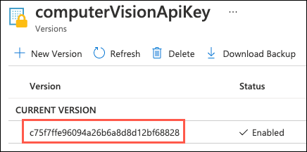

5. Copy the **Secret Identifier**.

    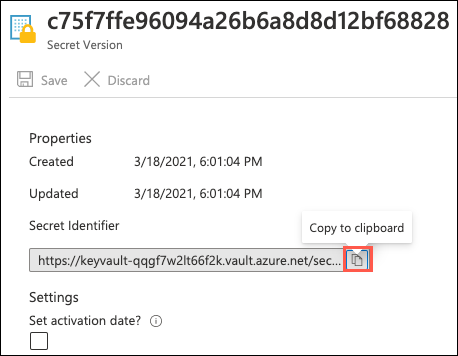

    When you add the Key Vault reference to this secret within a Function App's App Settings, you will use the following format: `@Microsoft.KeyVault(SecretUri={referenceString})`, where `{referenceString}` is replaced by the Secret Identifier (URI) value above. **Be sure to remove the curly braces (`{}`)**.

    For example, a complete reference would look like the following:

    `@Microsoft.KeyVault(SecretUri=https://tollboothvault.vault.azure.net/secrets/blobStorageConnection/d6ea0e39236348539dc33565e031afc3)`

When you are done creating the values, you should have a list similar to the following:

```text
@Microsoft.KeyVault(SecretUri=https://tollboothvault.vault.azure.net/secrets/blobStorageConnection/771aa40adac64af0b2aefbd741bd46ef)
@Microsoft.KeyVault(SecretUri=https://tollboothvault.vault.azure.net/secrets/computerVisionApiKey/ce228a43f40140dd8a9ffb9a25d042ee)
@Microsoft.KeyVault(SecretUri=https://tollboothvault.vault.azure.net/secrets/cosmosDBAuthorizationKey/1f9a0d16ad22409b85970b3c794a218c)
@Microsoft.KeyVault(SecretUri=https://tollboothvault.vault.azure.net/secrets/eventGridTopicKey/e310bcd71a72489f89b6112234fed815)
```

## Exercise 2: Develop and publish the photo processing and data export functions

**Duration**: 45 minutes

Use Visual Studio and its integrated Azure Functions tooling to develop and debug the functions locally, and then publish them to Azure. The starter project solution, TollBooths, contains most of the code needed. You will add in the missing code before deploying to Azure.

### Help references

|                                       |                                                                        |
| ------------------------------------- | :--------------------------------------------------------------------: |
| **Description**                       |                               **Links**                                |
| Code and test Azure Functions locally | <https://docs.microsoft.com/azure/azure-functions/functions-run-local> |

### Task 1: Create a system-assigned managed identity for your Function App to connect to Key Vault

In order for your Function App to be able to access Key Vault to read the secrets, you must [create a system-assigned managed identity](https://docs.microsoft.com/azure/app-service/overview-managed-identity#adding-a-system-assigned-identity) for the Function App, and [create an access policy in Key Vault](https://docs.microsoft.com/azure/key-vault/key-vault-secure-your-key-vault#key-vault-access-policies) for the application identity.

1. Open the **ServerlessArchitecture** resource group, and then select the Azure Function App you created whose name ends with **FunctionApp**. This is the one you created using the **.NET Core** runtime stack. If you did not use this naming convention, that's fine. Just be sure to make note of the name so you can distinguish it from the Function App you will be developing using the portal later on.

    

2. Select **Identity** in the left-hand menu. Within the **System assigned** tab, switch **Status** to **On**. Select **Save**.

    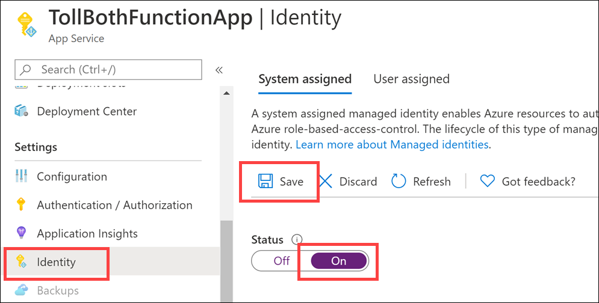

### Task 2: Configure application settings

In this task, you will apply application settings using the Microsoft Azure Portal.

1. Select **Configuration** in the left-hand menu.

    

2. Scroll to the **Application settings** section. Use the **+ New application setting** link to create the following additional Key/Value pairs (the key names must exactly match those found in the table below). **Be sure to remove the curly braces (`{}`)**.

    |                          |                                                                                                                                                             |
    | ------------------------ | :---------------------------------------------------------------------------------------------------------------------------------------------------------: |
    | **Application Key**      |                                                                          **Value**                                                                          |
    | computerVisionApiUrl     | Computer Vision API endpoint you copied earlier. Append **vision/v2.0/ocr** to the end. Example: `https://<YOUR-SERVICE-NAME>.cognitiveservices.azure.com/vision/v2.0/ocr` |
    | computerVisionApiKey     |                                                                   Enter `@Microsoft.KeyVault(SecretUri={referenceString})`, where `{referenceString}` is the URI for the **computerVisionApiKey** Key Vault secret                                                                   |
    | eventGridTopicEndpoint   |                                                                  Event Grid Topic endpoint                                                                  |
    | eventGridTopicKey        |                                                                 Enter `@Microsoft.KeyVault(SecretUri={referenceString})`, where `{referenceString}` is the URI for the **eventGridTopicKey** Key Vault secret                                                                 |
    | cosmosDBEndPointUrl      |                                                                        Cosmos DB URI                                                                        |
    | cosmosDBAuthorizationKey |                                                                    Enter `@Microsoft.KeyVault(SecretUri={referenceString})`, where `{referenceString}` is the URI for the **cosmosDBAuthorizationKey** Key Vault secret                                                                    |
    | cosmosDBDatabaseId       |                                                            Cosmos DB database id (LicensePlates)                                                            |
    | cosmosDBCollectionId     |                                                        Cosmos DB processed collection id (Processed)                                                        |
    | exportCsvContainerName   |                                                       Blob storage CSV export container name (export)                                                       |
    | blobStorageConnection    |                                                               Enter `@Microsoft.KeyVault(SecretUri={referenceString})`, where `{referenceString}` is the URI for the **blobStorageConnection** Key Vault secret                                                                |

    

3. Select **Save**.

    

### Task 3: Add Function App to Key Vault access policy

Perform these steps to create an access policy that enables the "Get" secret permission:

1. Open your Key Vault service.

2. Select **Access policies**.

3. Select **+ Add Access Policy**.

    

4. Select the **Select principal** section on the Add access policy form.

    

5. In the Principal blade, search for your TollBoothFunctionApp Function App's service principal, select it, then select the **Select** button.

    

6. Expand the **Secret permissions** and check **Get** under Secret Management Operations.

    

7. Select **Add** to add the new access policy.

8. When you are done, you should have an access policy for the Function App's managed identity. Select **Save** to finish the process.

    

### Task 4: Finish the ProcessImage function

There are a few components within the starter project that must be completed, marked as TODO in the code. The first set of TODO items we will address are in the ProcessImage function, the FindLicensePlateText class that calls the Computer Vision API, and finally the SendToEventGrid.cs class, which is responsible for sending processing results to the Event Grid topic you created earlier.

> **Note:** Do **NOT** update the version of any NuGet package. This solution is built to function with the NuGet package versions currently defined within. Updating these packages to newer versions could cause unexpected results.

1. Navigate to the **TollBooth** project (`C:\ServerlessMCW\MCW-Serverless-architecture-master\hands-on-lab\starter\TollBooth\TollBooth.sln`) using the Solution Explorer of Visual Studio.

2. From the Visual Studio **View** menu, select **Task List**.

    

3. There you will see a list of TODO tasks, where each task represents one line of code that needs to be completed.

    

4. Open **ProcessImage.cs**. Notice that the Run method is decorated with the FunctionName attribute, which sets the name of the Azure Function to "ProcessImage". This is triggered by HTTP requests sent to it from the Event Grid service. You tell Event Grid that you want to get these notifications at your function's URL by creating an event subscription, which you will do in a later task, in which you subscribe to blob-created events. The function's trigger watches for new blobs being added to the images container of the storage account that was created in Exercise 1. The data passed to the function from the Event Grid notification includes the URL of the blob. That URL is in turn passed to the input binding to obtain the uploaded image from Blob storage.

5. The following code represents the completed task in ProcessImage.cs:

    ```csharp
    // **TODO 1: Set the licensePlateText value by awaiting a new FindLicensePlateText.GetLicensePlate method.**

    licensePlateText = await new FindLicensePlateText(log, _client).GetLicensePlate(licensePlateImage);
    ```

6. Open **FindLicensePlateText.cs**. This class is responsible for contacting the Computer Vision API to find and extract the license plate text from the photo, using OCR. Notice that this class also shows how you can implement a resilience pattern using [Polly](https://github.com/App-vNext/Polly), an open source .NET library that helps you handle transient errors. This is useful for ensuring that you do not overload downstream services, in this case, the Computer Vision API. This will be demonstrated later on when visualizing the Function's scalability.

7. The following code represents the completed task in FindLicensePlateText.cs:

    ```csharp
    // TODO 2: Populate the below two variables with the correct AppSettings properties.
    var uriBase = Environment.GetEnvironmentVariable("computerVisionApiUrl");
    var apiKey = Environment.GetEnvironmentVariable("computerVisionApiKey");
    ```

8. Open **SendToEventGrid.cs**. This class is responsible for sending an Event to the Event Grid topic, including the event type and license plate data. Event listeners will use the event type to filter and act on the events they need to process. Make note of the event types defined here (the first parameter passed into the Send method), as they will be used later on when creating new functions in the second Function App you provisioned earlier.

9. The following code represents the completed tasks in `SendToEventGrid.cs`:

    ```csharp
    // TODO 3: Modify send method to include the proper eventType name value for saving plate data.
    await Send("savePlateData", "TollBooth/CustomerService", data);

    // TODO 4: Modify send method to include the proper eventType name value for queuing plate for manual review.
    await Send("queuePlateForManualCheckup", "TollBooth/CustomerService", data);
    ```

    > **Note**: TODOs 5, 6, and 7 will be completed in later steps of the guide.

### Task 5: Publish the Function App from Visual Studio

In this task, you will publish the Function App from the starter project in Visual Studio to the existing Function App you provisioned in Azure.

1. Navigate to the **TollBooth** project using the Solution Explorer of Visual Studio.

2. Right-click the **TollBooth** project and select **Publish** from the context menu.

    

3. In the Publish window, select **Azure**, then select **Next**.

    

    > **Note**: If you do not see the ability to publish to an Azure Function, you may need to update your Visual Studio instance.

4. In the App Service form, select your **Subscription**, select **Resource Group** under **View**, then expand your **ServerlessArchitecture** resource group and select the Function App whose name ends with **FunctionApp**. Finally, **uncheck the `Run from package file` option**.

5. Whatever you named the Function App when you provisioned it is fine. Just make sure it is the same one to which you applied the Application Settings in Task 1 of this exercise.

    

    > **Note**: We do not want to run from a package file, because when we deploy from GitHub later on, the build process will be skipped if the Function App is configured for a zip deployment.

6. After you select the Function App, select **Finish**.

    > **Note**: If prompted to update the functions version on Azure, select **Yes**.

7. Select **Publish** to start the process. Watch the Output window in Visual Studio as the Function App publishes. When it is finished, you should see a message that says, `========== Publish: 1 succeeded, 0 failed, 0 skipped ==========`.

    

8. Using a new tab or instance of your browser navigate to the Azure portal, <http://portal.azure.com>.

9. Open the **ServerlessArchitecture** resource group, then select the Azure Function App to which you just published.

10. Select **Functions** in the left-hand menu. You should see both functions you just published from the Visual Studio solution listed.

    

11. Now we need to add an Event Grid subscription to the ProcessImage function, so the function is triggered when new images are added to blob storage. Select the **ProcessImage** function, select **Integration** on the left-hand menu, select **Event Grid Trigger (eventGridEvent)**, then select **Create Event Grid subscription**.

    

12. On the **Create Event Subscription** blade, specify the following configuration options:

    a. **Name**: Unique value for the App name similar to **processimagesub** (ensure the green check mark appears).

    b. **Event Schema**: Select Event Grid Schema.

    c. For **Topic Type**, select **Storage Accounts (Blob & GPv2)**.

    d. Select your **subscription** and **ServerlessArchitecture** resource group.

    e. For resource, select your recently created storage account. Enter **processimagesubtopic** into the **System Topic Name** field.

    f. Select only the **Blob Created** from the event types dropdown list.

    g. Leave Azure Function as the Endpoint Type.

13. Leave the remaining fields at their default values and select **Create**.

    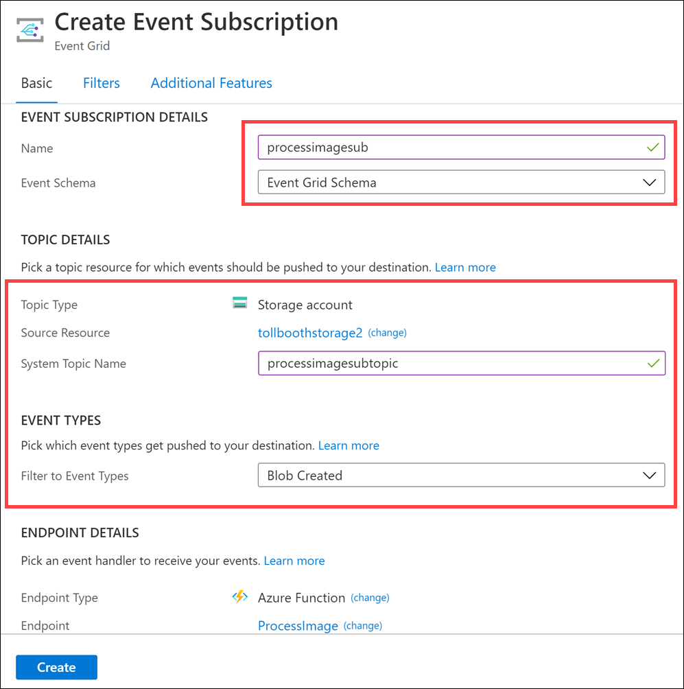

## Exercise 3: Create functions in the portal

**Duration**: 45 minutes

Create two new Azure Functions written in Node.js, using the Azure portal. These will be triggered by Event Grid and output to Azure Cosmos DB to save the results of license plate processing done by the ProcessImage function.

### Help references

|                                                                   |                                                                                                         |
| ----------------------------------------------------------------- | :-----------------------------------------------------------------------------------------------------: |
| **Description**                                                   |                                                **Links**                                                |
| Create your first function in the Azure portal                    |        <https://docs.microsoft.com/azure/azure-functions/functions-create-first-azure-function>         |
| Store unstructured data using Azure Functions and Azure Cosmos DB | <https://docs.microsoft.com/azure/azure-functions/functions-integrate-store-unstructured-data-cosmosdb> |

### Task 1: Create function to save license plate data to Azure Cosmos DB

In this task, you will create a new Node.js function triggered by Event Grid and that outputs successfully processed license plate data to Azure Cosmos DB.

1. Using a new tab or instance of your browser navigate to the Azure portal, <http://portal.azure.com>.

2. Open the **ServerlessArchitecture** resource group, then select the Azure Function App you created whose name ends with **Events**. If you did not use this naming convention, make sure you select the Function App that you _did not_ deploy to in the previous exercise.

3. Select **Functions** in the left-hand menu, then select **+ Add**.

    

4. Enter **event grid** into the template search form, then select the **Azure Event Grid trigger** template.

    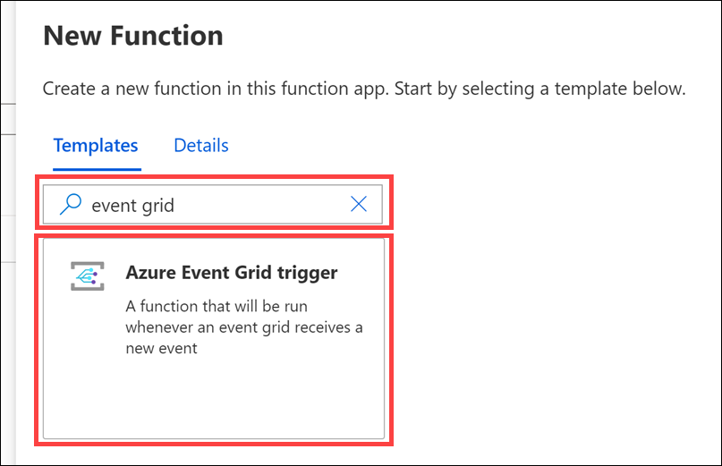

5. In the _New Function_ form, enter `SavePlateData` for the **Name**, then select **Create Function**.

    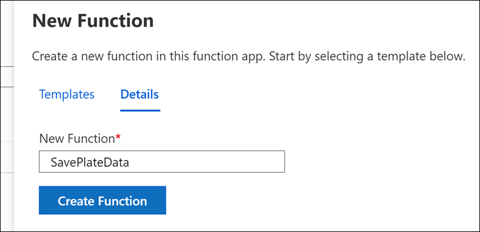

6. Select **Code + Test**, then replace the code in the new SavePlateData function with the following:

    ```javascript
    module.exports = function(context, eventGridEvent) {
        context.log(typeof eventGridEvent);
        context.log(eventGridEvent);

        context.bindings.outputDocument = {
            fileName: eventGridEvent.data['fileName'],
            licensePlateText: eventGridEvent.data['licensePlateText'],
            timeStamp: eventGridEvent.data['timeStamp'],
            exported: false
        };

        context.done();
    };
    ```

    

7. Select **Save**.

8. If you see the following error about Application Insights not being configured, ignore for now. We will add Application Insights in a later exercise.

    

### Task 2: Add an Event Grid subscription to the SavePlateData function

In this task, you will add an Event Grid subscription to the SavePlateData function. This will ensure that the events sent to the Event Grid topic containing the savePlateData event type are routed to this function.

1. With the SavePlateData function open, select **Integration** in the left-hand menu, select **Event Grid Trigger (eventGridEvent)**, then select **Create Event Grid subscription**.

    

2. On the **Create Event Subscription** blade, specify the following configuration options:

    a. **Name**: Unique value for the App name similar to **saveplatedatasub** (ensure the green check mark appears).

    b. **Event Schema**: Select **Event Grid Schema**.

    c. For **Topic Type**, select **Event Grid Topics**.

    d. Select your **Subscription** and **ServerlessArchitecture** resource group.

    e. For resource, select your recently created Event Grid.

    f. For Event Types, select **Add Event Type**.

    g. Enter `savePlateData` for the new event type value. This will ensure this function is only triggered by this Event Grid type.

    h. Leave Azure Function as the Endpoint Type.

3. Leave the remaining fields at their default values and select **Create**.

    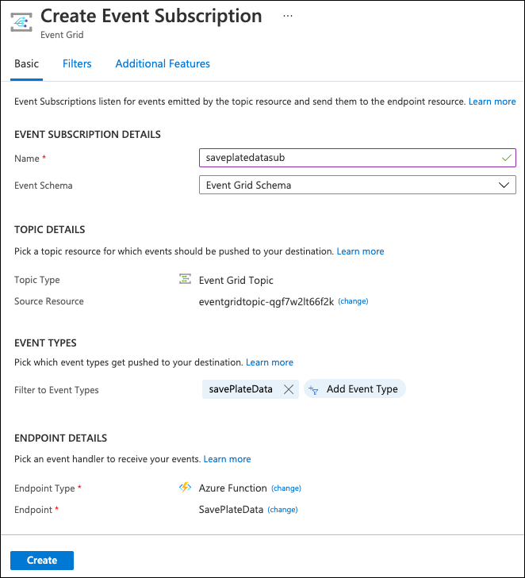

### Task 3: Add an Azure Cosmos DB output to the SavePlateData function

In this task, you will add an Azure Cosmos DB output binding to the SavePlateData function, enabling it to save its data to the Processed collection.

1. Close the Edit Trigger blade if it is still open. Select **+ Add output** under `Outputs` within Integrations. In the `Create Output` blade that appears, select the **Azure Cosmos DB** binding type.

    

2. Scroll down in the Create Output form, then select **New** underneath to the Azure Cosmos DB account connection field.

    

    > **Note**: If you see a notice for "Extensions not installed", select **Install**.

    

3. Select your Cosmos DB account from the list that appears.

4. Specify the following configuration options in the Azure Cosmos DB output form:

    a. For database name, type **LicensePlates**.

    b. For the collection name, type **Processed**.

    

5. Select **OK**.

    > **Note**: you should wait for the template dependency to install if you were prompted earlier.

### Task 4: Create function to save manual verification info to Azure Cosmos DB

In this task, you will create a new function triggered by Event Grid and outputs information about photos that need to be manually verified to Azure Cosmos DB.

1. Close the `SavePlateData` function. Select the **+ Add** button within the **Functions** blade of the Function App.

    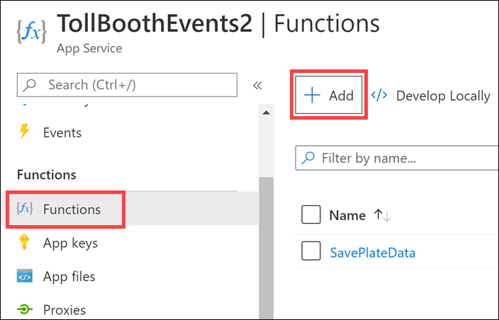

2. Enter **event grid** into the template search form, then select the **Azure Event Grid trigger** template.

    

3. In the **New Function** form, fill out the following properties:

    a. For name, type **QueuePlateForManualCheckup**

    

4. Select **Create Function**.

5. Select **Code + Test**, then replace the code in the new SavePlateData function with the following:

    ```javascript
    module.exports = async function(context, eventGridEvent) {
        context.log(typeof eventGridEvent);
        context.log(eventGridEvent);

        context.bindings.outputDocument = {
            fileName: eventGridEvent.data['fileName'],
            licensePlateText: '',
            timeStamp: eventGridEvent.data['timeStamp'],
            resolved: false
        };

        context.done();
    };
    ```

6. Select **Save**.

7. If you see the following error about Application Insights not being configured, ignore for now. We will add Application Insights in a later exercise.

    

### Task 5: Add an Event Grid subscription to the QueuePlateForManualCheckup function

In this task, you will add an Event Grid subscription to the QueuePlateForManualCheckup function. This will ensure that the events sent to the Event Grid topic containing the queuePlateForManualCheckup event type are routed to this function.

1. With the QueuePlateForManualCheckup function open, select **Integration** in the left-hand menu, select **Event Grid Trigger (eventGridEvent)**, then select **Create Event Grid subscription**.

    

2. On the **Create Event Subscription** blade, specify the following configuration options:

    a. **Name**: Unique value for the App name similar to **queueplateformanualcheckupsub** (ensure the green check mark appears).

    b. **Event Schema**: Select **Event Grid Schema**.

    c. For **Topic Type**, select **Event Grid Topics**.

    d. Select your **Subscription** and **ServerlessArchitecture** resource group.

    e. For resource, select your recently created Event Grid.

    f. For Event Types, select **Add Event Type**.

    g. Enter `queuePlateForManualCheckup` for the new event type value. This will ensure this function is only triggered by this Event Grid type.

    h. Leave Azure Function as the Endpoint Type.

3. Leave the remaining fields at their default values and select **Create**.

    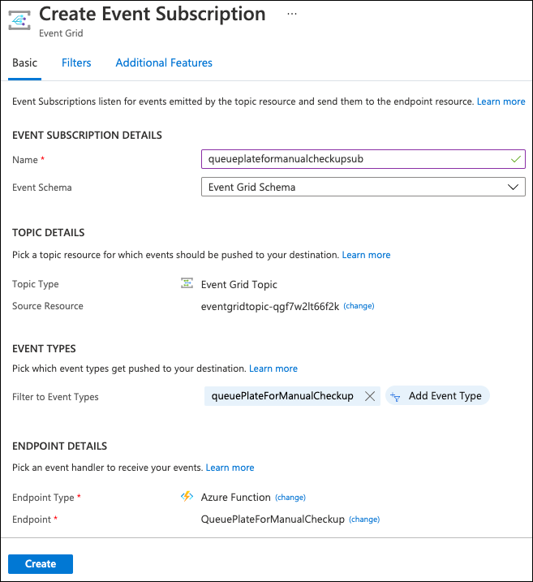

### Task 6: Add an Azure Cosmos DB output to the QueuePlateForManualCheckup function

In this task, you will add an Azure Cosmos DB output binding to the QueuePlateForManualCheckup function, enabling it to save its data to the NeedsManualReview collection.

1. Close the Edit Trigger blade if it is still open. Select **+ Add output** under `Outputs` within Integrations. In the `Create Output` blade that appears, select the **Azure Cosmos DB** binding type.

    

2. Specify the following configuration options in the Azure Cosmos DB output form:

    a. For database name, enter **LicensePlates**.

    b. For collection name, enter **NeedsManualReview**.

    c. Select the **Azure Cosmos DB account connection** you created earlier.

    

3. Select **OK**.

## Exercise 4: Monitor your functions with Application Insights

**Duration**: 45 minutes

Application Insights can be integrated with Azure Function Apps to provide robust monitoring for your functions. In this exercise, you will provision a new Application Insights account and configure your Function Apps to send telemetry to it.

### Help references

|                                                               |                                                                                  |
| ------------------------------------------------------------- | :------------------------------------------------------------------------------: |
| **Description**                                               |                                    **Links**                                     |
| Monitor Azure Functions using Application Insights            |     <https://docs.microsoft.com/azure/azure-functions/functions-monitoring>      |
| Live Metrics Stream: Monitor & Diagnose with 1-second latency | <https://docs.microsoft.com/azure/application-insights/app-insights-live-stream> |

### Task 1: Provision an Application Insights instance

1. Navigate to the Azure portal, <http://portal.azure.com>.

2. Select **+ Create a resource**, then type **application insights** into the search box on top. Select **Application Insights** from the results.

    

3. Select the **Create** button on the **Application Insights overview** blade.

4. On the **Application Insights** blade, specify the following configuration options:

    a. **Name**: Unique value for the App name similar to **TollboothMonitor** (ensure the green check mark appears).

    b. **Resource Group**: Select **ServerlessArchitecture**.

    c. Select the same **Region** as your Resource Group region.

    d. **Resource Mode**: Select **Classic**.

    

5. Select **Review + Create**, then choose **Create**.

### Task 2: Enable Application Insights integration in your Function Apps

Both of the Function Apps need to be updated with the Application Insights instrumentation key so they can start sending telemetry to your new instance.

1. After the Application Insights account has completed provisioning, open the instance by opening the **ServerlessArchitecture** resource group, and then selecting the your recently created application insights instance.

2. Copy the **Instrumentation Key** from the Essentials section of the **Overview** blade.

    > **Note**: You may need to expand the **Essentials** section.

    

3. Open the Azure Function App you created whose name ends with **FunctionApp**, or the name you specified for the Function App containing the ProcessImage function.

4. Select **Configuration** in the left-hand menu.

5. Scroll down to the **Application settings** section. Use the **+ Add new setting** link and name the new setting **APPINSIGHTS_INSTRUMENTATIONKEY**. Paste the copied instrumentation key into its value field.

    

6. Select **OK**.

7. Select **Save**.

    

8. Follow the steps above to add the APPINSIGHTS_INSTRUMENTATIONKEY setting to the function app that ends in **Events**.

### Task 3: Use the Live Metrics Stream to monitor functions in real time

Now that Application Insights has been integrated into your Function Apps, you can use the Live Metrics Stream to see the functions' telemetry in real time.

1. Open the Azure Function App you created whose name ends with **FunctionApp**, or the name you specified for the Function App containing the ProcessImage function.

2. Select **Application Insights** on the left-hand menu. Select **Turn on Application Insights** in the Application Insights blade.

    

3. Make sure **Enable** is selected. Notice that your app is already linked to your Application Insights instance at this point. Select **Apply**. Select **Yes** when prompted to apply monitoring settings.

    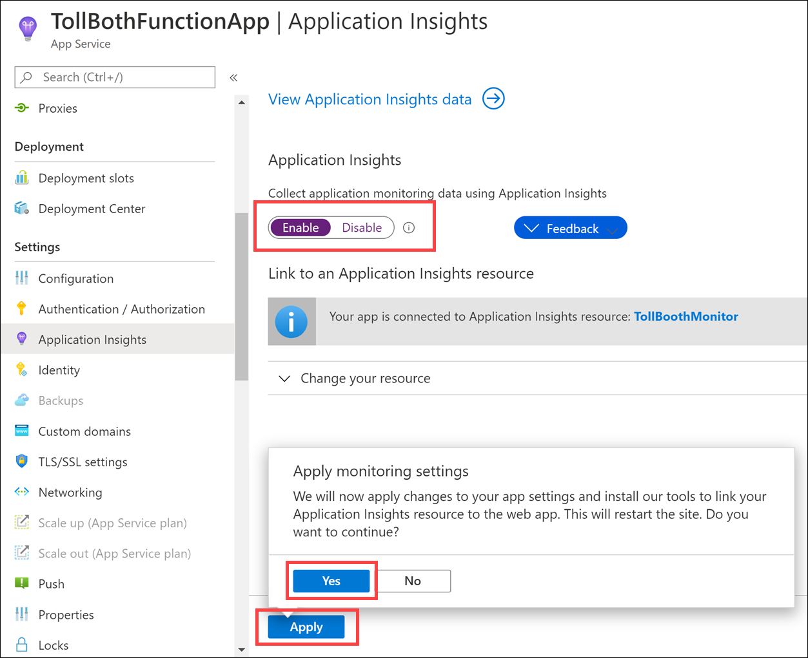

4. Open the Azure Function App you created whose name ends with **Events**, or the name you specified for the Function App containing the NodeJS functions.

5. Select **Application Insights** on the left-hand menu. Select **Turn on Application Insights** in the Application Insights blade.

    

6. Make sure **Enable** is selected. Notice that your app is already linked to your Application Insights instance at this point. Select **Apply**. Select **Yes** when prompted to apply monitoring settings.

    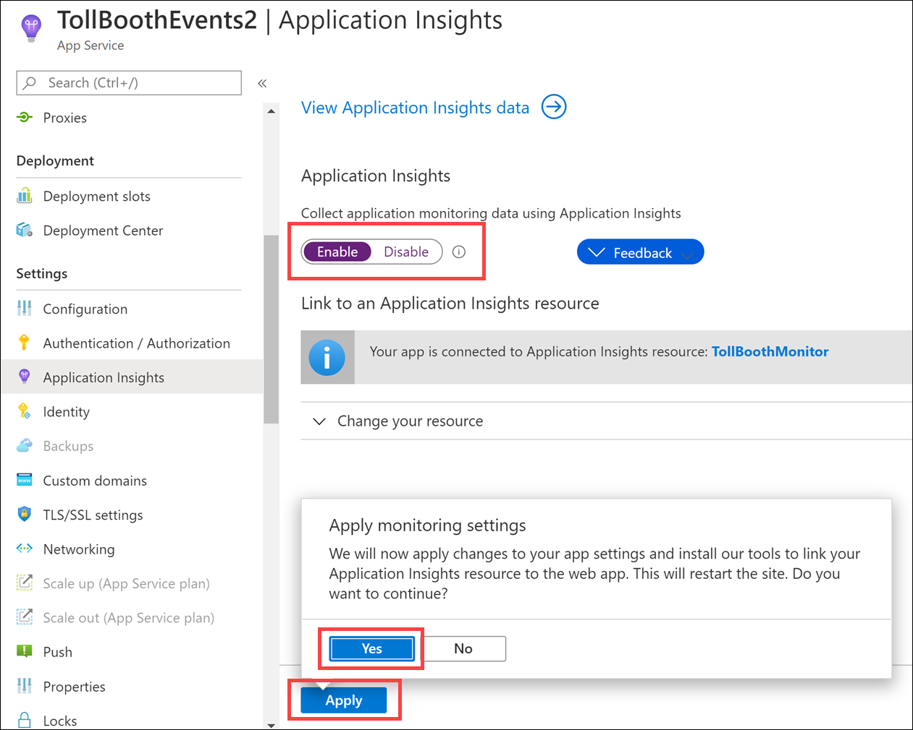

7. Select your Application Insights name under `Link to an Application Insights resource`.

    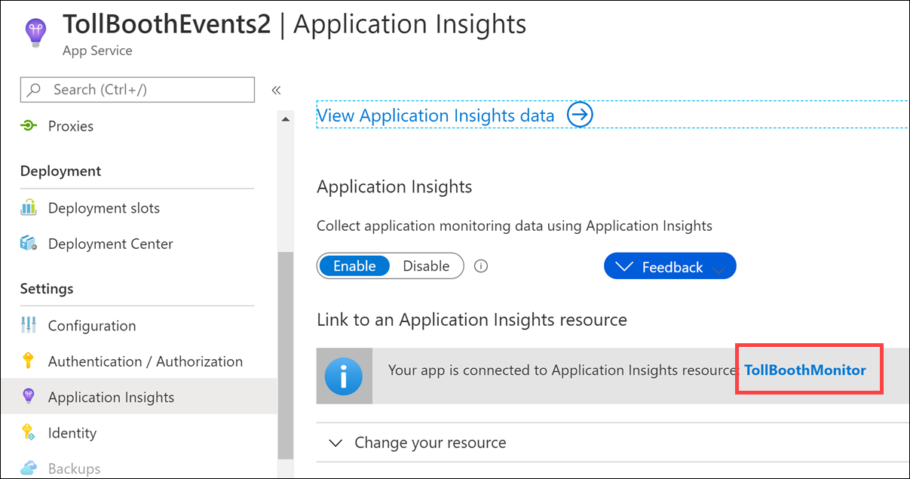

8. In Application Insights, select **Live Metrics Stream** underneath Investigate in the menu.

    

9. Leave the Live Metrics Stream open and go back to the starter app solution in Visual Studio.

10. Navigate to the **UploadImages** project using the Solution Explorer of Visual Studio. Right-click on **UploadImages**, then select **Properties**.

    

11. Select **Debug** in the left-hand menu, then paste the connection string for your Blob storage account into the **Command line arguments** text field. This will ensure that the required connection string is added as an argument each time you run the application. Additionally, the combination of adding the value here and the `.gitignore` file included in the project directory will prevent the sensitive connection string from being added to your source code repository in a later step.

    

12. Save your changes.

13. Right-click the **UploadImages** project in the Solution Explorer, then select **Debug** then **Start new instance** from the context menu.

    

14. When the console window appears, enter **1** and press **ENTER**. This uploads a handful of car photos to the images container of your Blob storage account.

    

15. Switch back to your browser window with the Live Metrics Stream still open within Application Insights. You should start seeing new telemetry arrive, showing the number of servers online, the incoming request rate, CPU process amount, etc. You can select some of the sample telemetry in the list to the side to view output data.

    

16. Leave the Live Metrics Stream window open once again, and close the console window for the image upload. Debug the UploadImages project again, then enter **2** and press **ENTER**. This will upload 1,000 new photos.

    

17. Switch back to the Live Metrics Stream window and observe the activity as the photos are uploaded. You can see the number of servers online, which translate to the number of Function App instances that are running between both Function Apps. You should also notice things such as a steady cadence for the Request Rate monitor, the Request Duration hovering below \~200ms second, and the Incoming Requests roughly matching the Outgoing Requests.

    

18. After this has run for a while, close the image upload console window once again, but leave the Live Metrics Stream window open.

### Task 4: Observe your functions dynamically scaling when resource-constrained

In this task, you will change the Computer Vision API to the Free tier. This will limit the number of requests to the OCR service to 10 per minute. Once changed, run the UploadImages console app to upload 1,000 images again. The resiliency policy programmed into the FindLicensePlateText.MakeOCRRequest method of the ProcessImage function will begin exponentially backing off requests to the Computer Vision API, allowing it to recover and lift the rate limit. This intentional delay will greatly increase the function's response time, thus causing the Consumption plan's dynamic scaling to kick in, allocating several more servers. You will watch all of this happen in real time using the Live Metrics Stream view.

1. Open your Computer Vision API service by opening the **ServerlessArchitecture** resource group, and then selecting the **Cognitive Services** service name.

2. Select **Pricing tier** under Resource Management in the menu. Select the **F0 Free** pricing tier, then choose **Select**.

    > **Note**: If you already have an **F0** free pricing tier instance, you will not be able to create another one.

    

3. Switch to Visual Studio, debug the **UploadImages** project again, then enter **2** and press **ENTER**. This will upload 1,000 new photos.

    

4. Switch back to the Live Metrics Stream window and observe the activity as the photos are uploaded. After running for a couple of minutes, you should start to notice a few things. The Request Duration will start to increase over time. As this happens, you should notice more servers being brought online. Each time a server is brought online, you should see a message in the Sample Telemetry stating that it is "Generating 2 job function(s)", followed by a Starting Host message. You should also see messages logged by the resilience policy that the Computer Vision API server is throttling the requests. This is known by the response codes sent back from the service (429). A sample message is "Computer Vision API server is throttling our requests. Automatically delaying for 16000ms".

    > **Note**: If you select a sample telemetry and cannot see its details, drag the resize bar at the bottom of the list up to resize the details pane.

    

5. After this has run for some time, close the UploadImages console to stop uploading photos.

6. Navigate back to the **Computer Vision** API and set the pricing tier back to **S1 Standard**.

## Exercise 5: Explore your data in Azure Cosmos DB

**Duration**: 15 minutes

In this exercise, you will use the Azure Cosmos DB Data Explorer in the portal to view saved license plate data.

### Help references

|                       |                                                           |
| --------------------- | :-------------------------------------------------------: |
| **Description**       |                         **Links**                         |
| About Azure Cosmos DB | <https://docs.microsoft.com/azure/cosmos-db/introduction> |


> **Note:** Ensure that your IP address is added to the IP list under the Firewall settings in your Azure Cosmos DB account. If not, then you will not able to see the License Plates data within Azure Cosmos DB.

### Task 1: Use the Azure Cosmos DB Data Explorer

1. Open your Azure Cosmos DB account by opening the **ServerlessArchitecture** resource group, and then selecting the **Azure Cosmos DB account** name.

2. Select **Data Explorer** from the menu.

    

3. Expand the **Processed** collection, then select **Items**. This will list each of the JSON documents added to the collection.

4. Select one of the documents to view its contents. The first four properties are ones that were added by your functions. The remaining properties are standard and are assigned by Cosmos DB.

    

5. Expand the **NeedsManualReview** collection, then select **Items**.

6. Select one of the documents to view its contents. Notice that the filename is provided, as well as a property named "resolved". While this is out of scope for this lab, those properties can be used together to provide a manual process for viewing the photo and entering the license plate.

    

7. Select the ellipses (...) next to the **Processed** collection and select **New SQL Query**.

    

8. Modify the SQL query to count the number of processed documents that have not been exported:

    ```sql
    SELECT VALUE COUNT(1) FROM c WHERE c.exported = false
    ```

9. Execute the query and observe the results. In our case, we have 669 processed documents that need to be exported.

    

## Exercise 6: Create the data export workflow

**Duration**: 30 minutes

In this exercise, you create a new Logic App for your data export workflow. This Logic App will execute periodically and call your ExportLicensePlates function, then conditionally send an email if there were no records to export.

### Help references

|                                      |                                                                                                                 |
| ------------------------------------ | :-------------------------------------------------------------------------------------------------------------: |
| **Description**                      |                                                    **Links**                                                    |
| What are Logic Apps?                 |                  <https://docs.microsoft.com/azure/logic-apps/logic-apps-what-are-logic-apps>                   |
| Call Azure Functions from logic apps | <https://docs.microsoft.com/azure/logic-apps/logic-apps-azure-functions%23call-azure-functions-from-logic-apps> |

### Task 1: Create the Logic App

1. Navigate to the Azure portal, <http://portal.azure.com>.

2. Select **+ Create a resource**, then enter **logic app** into the search box on top. Select **Logic App** from the results.

    

3. Select the **Create** button on the Logic App overview blade.

4. On the **Create Logic App** blade, specify the following configuration options:

    a. For Name, type a unique value for the App name similar to **TollBoothLogic** (ensure the green check mark appears).

    b. Specify the Resource Group **ServerlessArchitecture**.

    c. Select the **Region** option for the location, then select the same **Location** as your Resource Group region.

    d. Select **Off** underneath Log Analytics.

    

5. Select **Review + create**, then select **Create**. Open the Logic App once it has been provisioned.

6. In the Logic App Designer, scroll through the page until you locate the _Start with a common trigger_ section. Select the **Recurrence** trigger.

    

7. Enter **15** into the **Interval** box, and make sure Frequency is set to **Minute**. This can be set to an hour or some other interval, depending on business requirements.

8. Select **+ New step**.

    

9. Enter **Functions** in the filter box, then select the **Azure Functions** connector.

    

10. Select your Function App whose name ends in **FunctionApp**, or contains the ExportLicensePlates function.

    

11. Select the **ExportLicensePlates** function from the list.

    

12. This function does not require any parameters that need to be sent when it gets called. Select **+ New step**, then search for **condition**. Select the **Condition** Control option from the Actions search result.

    

13. For the **value** field, select the **Status code** parameter. Make sure the operator is set to **is equal to**, then enter **200** in the second value field.

    > **Note**: This evaluates the status code returned from the ExportLicensePlates function, which will return a 200 code when license plates are found and exported. Otherwise, it sends a 204 (NoContent) status code when no license plates were discovered that need to be exported. We will conditionally send an email if any response other than 200 is returned.

    

14. We will ignore the If true condition because we don't want to perform an action if the license plates are successfully exported. Select **Add an action** within the **If false** condition block.

    

15. Enter **Send an email** in the filter box, then select the **Send an email (V2)** action for Office 365 Outlook.

    

16. Select **Sign in** and sign into your Office 365 Outlook account.

    

17. In the Send an email form, provide the following values:

    a. Enter your email address in the **To** box.

    b. Provide a **Subject**, such as **Toll Booth license plate export failed**.

    c. Enter a message into the **Body**, and select the **Status code** from the ExportLicensePlates function so that it is added to the email body.

    

18. Select **Save** in the tool bar to save your Logic App.

19. Select **Run** to execute the Logic App. You should start receiving email alerts because the license plate data is not being exported. This is because we need to finish making changes to the ExportLicensePlates function so that it can extract the license plate data from Azure Cosmos DB, generate the CSV file, and upload it to Blob storage.

    

20. While in the Logic Apps Designer, you will see the run result of each step of your workflow. A green checkmark is placed next to each step that successfully executed, showing the execution time to complete. This can be used to see how each step is working, and you can select the executed step and see the raw output.

    

21. The Logic App will continue to run in the background, executing every 15 minutes (or whichever interval you set) until you disable it. To disable the app, go to the **Overview** blade for the Logic App and select the **Disable** button on the taskbar.

    

## Exercise 7: Configure continuous deployment for your Function App

**Duration**: 40 minutes

In this exercise, configure your Function App that contains the ProcessImage function for continuous deployment. You will first set up a GitHub source code repository, then set that as the deployment source for the Function App.

### Help references

|                                           |                                                                                    |
| ----------------------------------------- | :--------------------------------------------------------------------------------: |
| **Description**                           |                                     **Links**                                      |
| Creating a new GitHub repository          |           <https://help.github.com/articles/creating-a-new-repository/>            |
| Continuous deployment for Azure Functions | <https://docs.microsoft.com/azure/azure-functions/functions-continuous-deployment> |

### Task 1: Add git repository to your Visual Studio solution and deploy to GitHub

1. Open the **TollBooth** project in Visual Studio.

2. Right-click the **TollBooth** solution in Solution Explorer, then select **Add Solution to Source Control**.

    

3. Select **View** in Visual Studio's top menu, then select **Team Explorer**.

    

4. Select **Sync** in the Team Explorer.

    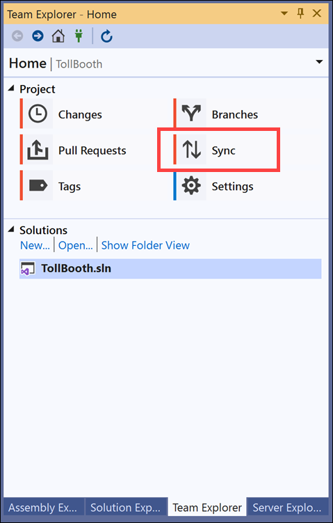

5. Choose the **Publish to GitHub** button, then sign in to your GitHub account when prompted.

    

6. Type in a name for the new GitHub repository, then select **Publish**. This will create the new GitHub repository, add it as a remote to your local git repo, then publish your new commit.

    

7. Refresh your GitHub repository page in your browser. You should see that the project files have been added. Navigate to the **TollBooth** folder of your repo. Notice that the local.settings.json file has not been uploaded. That's because the .gitignore file of the TollBooth project explicitly excludes that file from the repository, making sure you don't accidentally share your application secrets.

    

### Task 2: Configure your Function App to use your GitHub repository for continuous deployment

1. Open the Azure Function App you created whose name ends with **FunctionApp**, or the name you specified for the Function App containing the ProcessImage function.

2. Select **Deployment Center** underneath Deployment in the left-hand menu.

    

3. Select **GitHub** in the **Deployment Center** blade. Enter your GitHub credentials if prompted. Select **Continue**.

    

4. Select **App Service build service**, then select **Continue**.

    

5. **Choose your organization**.

6. Choose your new repository under **Choose project**. Make sure the **master branch** is selected.

    

7. Select **Continue**.

8. On the Summary page, select **Finish**.

9. After continuous deployment is configured, all file changes in your deployment source are copied to the function app and a full site deployment is triggered. The site is redeployed when files in the source are updated.

    

### Task 3: Finish your ExportLicensePlates function code and push changes to GitHub to trigger deployment

1. Navigate to the **TollBooth** project using the Solution Explorer of Visual Studio.

2. From the Visual Studio **View** menu, select **Task List**.

    

3. There you will see a list of TODO tasks, where each task represents one line of code that needs to be completed.

4. Open **DatabaseMethods.cs**.

5. The following code represents the completed task in DatabaseMethods.cs:

    ```csharp
        // TODO 5: Retrieve a List of LicensePlateDataDocument objects from the collectionLink where the exported value is false.
        licensePlates = _client.CreateDocumentQuery<LicensePlateDataDocument>(collectionLink,
                new FeedOptions() { EnableCrossPartitionQuery=true,MaxItemCount = 100 })
            .Where(l => l.exported == false)
            .ToList();
        // TODO 6: Remove the line below.
    ```

6. Make sure that you deleted the following line under TODO 6: `licensePlates = new List<LicensePlateDataDocument>();`.

7. Save your changes then open **FileMethods.cs**.

8. The following code represents the completed task in DatabaseMethods.cs:

    ```csharp
    // TODO 7: Asyncronously upload the blob from the memory stream.
    await blob.UploadFromStreamAsync(stream);
    ```

9. Save your changes.

10. Right-click the **TollBooth** project in Solution Explorer, then select **Commit...** under the **Source Control** menu item.

    

11. Enter a commit message, then select **Commit All**.

    

12. After committing, select the **Sync** link. This will allow us to add the remote GitHub repository.

    

13. Select the **Sync** button on the **Synchronization** step.

    

    Afterward, you should see a message stating that the incoming and outgoing commits were successfully synchronized.

14. Go back to Deployment Center for your Function App in the portal. You should see an entry for the deployment kicked off by this last commit. Check the timestamp on the message to verify that you are looking at the latest one. **Make sure the deployment completes before continuing**.

    

## Exercise 8: Rerun the workflow and verify data export

**Duration**: 10 minutes

With the latest code changes in place, run your Logic App and verify that the files are successfully exported.

### Task 1: Run the Logic App

1. Open your ServerlessArchitecture resource group in the Azure portal, then select your Logic App.

2. From the **Overview** blade, select **Enable**.

    

3. Now select **Run Trigger**, then select **Recurrence** to immediately execute your workflow.

    

4. Select the **Refresh** button next to the Run Trigger button to refresh your run history. Select the latest run history item. If the expression result for the condition is **true**, then that means the CSV file should've been exported to Blob storage. Be sure to disable the Logic App so it doesn't keep sending you emails every 15 minutes. Please note that it may take longer than expected to start running, in some cases.

    

### Task 2: View the exported CSV file

1. Open your ServerlessArchitecture resource group in the Azure portal, then select your **Storage account** you had provisioned to store uploaded photos and exported CSV files.

2. In the Overview pane of your storage account, select **Containers**.

    

3. Select the **export** container.

    

4. You should see at least one recently uploaded CSV file. Select the filename to view its properties.

    

5. Select **Download** in the blob properties window.

    

    The CSV file should look similar to the following:

    

6. The ExportLicensePlates function updates all of the records it exported by setting the exported value to true. This makes sure that only new records since the last export are included in the next one. Verify this by re-executing the script in Azure Cosmos DB that counts the number of documents in the Processed collection where exported is false. It should return 0 unless you've subsequently uploaded new photos.

## After the hands-on lab

**Duration**: 10 minutes

In this exercise, attendees will deprovision any Azure resources that were created in support of the lab.

### Task 1: Delete the resource group in which you placed your Azure resources

1. From the Portal, navigate to the blade of your **Resource Group** and select **Delete** in the command bar at the top.

2. Confirm the deletion by re-typing the **resource group name** and selecting **Delete**.

3. If you created a different resource group for your virtual machined, be sure to delete that as well.

4. Optionally, delete the GitHub repository you created for this lab by selecting **settings** and then **Delete this repository** from the GitHub website.

### Task 2: Delete the GitHub repo

1. Open <https://www.github.com>, then select your profile icon and select **Your repositories**.

2. Navigate to your repo and select it.

3. Select the **Settings** tab, scroll to the bottom, select **Delete this repository**.

You should follow all steps provided _after_ attending the Hands-on lab.
