<div class="MCWHeader1">
Serverless architecture
</div>

<div class="MCWHeader2">
Manual resource deployment and setup guide
</div>

<div class="MCWHeader3">
November 2021
</div>

Information in this document, including URL and other Internet Web site references, is subject to change without notice. Unless otherwise noted, the example companies, organizations, products, domain names, e-mail addresses, logos, people, places, and events depicted herein are fictitious, and no association with any real company, organization, product, domain name, e-mail address, logo, person, place or event is intended or should be inferred. Complying with all applicable copyright laws is the responsibility of the user. Without limiting the rights under copyright, no part of this document may be reproduced, stored in or introduced into a retrieval system, or transmitted in any form or by any means (electronic, mechanical, photocopying, recording, or otherwise), or for any purpose, without the express written permission of Microsoft Corporation.

Microsoft may have patents, patent applications, trademarks, copyrights, or other intellectual property rights covering subject matter in this document. Except as expressly provided in any written license agreement from Microsoft, the furnishing of this document does not give you any license to these patents, trademarks, copyrights, or other intellectual property.

The names of manufacturers, products, or URLs are provided for informational purposes only and Microsoft makes no representations and warranties, either expressed, implied, or statutory, regarding these manufacturers or the use of the products with any Microsoft technologies. The inclusion of a manufacturer or product does not imply endorsement of Microsoft of the manufacturer or product. Links may be provided to third party sites. Such sites are not under the control of Microsoft and Microsoft is not responsible for the contents of any linked site or any link contained in a linked site, or any changes or updates to such sites. Microsoft is not responsible for webcasting or any other form of transmission received from any linked site. Microsoft is providing these links to you only as a convenience, and the inclusion of any link does not imply endorsement of Microsoft of the site or the products contained therein.

© 2021 Microsoft Corporation. All rights reserved.

Microsoft and the trademarks listed at <https://www.microsoft.com/legal/intellectualproperty/Trademarks/Usage/General.aspx> are trademarks of the Microsoft group of companies. All other trademarks are property of their respective owners.

<!-- TOC -->
**Contents**:

- [Serverless architecture manual resource deployment and setup guide](#serverless-architecture-manual-resource-deployment-and-setup-guide)
  - [Requirements](#requirements)
  - [Task 1: Provision an Azure Data Lake Storage Gen2 account](#task-1-provision-an-azure-data-lake-storage-gen2-account)
  - [Task 2: Provision the TollBooth Function App](#task-2-provision-the-tollbooth-function-app)
  - [Task 3: Provision the Events Function App](#task-3-provision-the-events-function-app)
  - [Task 4: Provision an Event Grid topic](#task-4-provision-an-event-grid-topic)
  - [Task 5: Provision and configure an Azure Cosmos DB account](#task-5-provision-and-configure-an-azure-cosmos-db-account)
  - [Task 6: Provision the Computer Vision API service](#task-6-provision-the-computer-vision-api-service)
  - [Task 7: Create a Logic App](#task-7-create-a-logic-app)
  - [Task 8: Provision Azure Key Vault](#task-8-provision-azure-key-vault)
  - [Task 9: Retrieve the URI for each secret](#task-9-retrieve-the-uri-for-each-secret)
  - [Task 10: Configure application settings for the TollBoothFunctions Function App](#task-10-configure-application-settings-for-the-tollboothfunctions-function-app)
  - [Task 11: Set up a development virtual machine](#task-11-set-up-a-development-virtual-machine)
  - [Task 12: Connect to the Lab VM](#task-12-connect-to-the-lab-vm)
  - [Task 13: Disable Internet Explorer Enhanced Security](#task-13-disable-internet-explorer-enhanced-security)
  - [Task 14: Install required software on the LabVM](#task-14-install-required-software-on-the-labvm)

<!-- /TOC -->

# Serverless architecture manual resource deployment and setup guide

**Duration**: 30 minutes

This guide provides instructions for manually performing Task 2 (Run ARM template to provision lab resources) of the before the hands-on lab guide. The step-by-step directions below manually provision and configure the resources created by the ARM template.

Ensure all resources use the same resource group for easier cleanup.

> **Important**: Many Azure resources require globally unique names. Throughout these steps, you will see the word "SUFFIX" as part of resource names. You should replace this with your Microsoft alias, initials, or other value to ensure uniquely named resources.

## Requirements

- Microsoft Azure subscription (non-Microsoft subscription)
- Local machine or a virtual machine configured with (**complete the day before the lab!**):
  - Visual Studio Community 2019 or greater
    - <https://www.visualstudio.com/vs/>
  - Azure development workload for Visual Studio 2019
    - <https://docs.microsoft.com/azure/azure-functions/functions-develop-vs#prerequisites>
  - .NET Core 3.1
    - <https://www.microsoft.com/net/download/windows>
- Office 365 account. If required, you can sign up for an Office 365 trial at:
  - <https://portal.office.com/Signup/MainSignup15.aspx?Dap=False&QuoteId=79a957e9-ad59-4d82-b787-a46955934171&ali=1>
- GitHub account. You can create a free account at <https://github.com>.

## Task 1: Provision an Azure Data Lake Storage Gen2 account

1. In the [Azure portal](https://portal.azure.com/), select the **Show portal menu** icon and then select **+Create a resource** from the menu.

   

2. Enter "storage account" into the Search the Marketplace box, select **Storage account** from the results, and then select **Create**.

   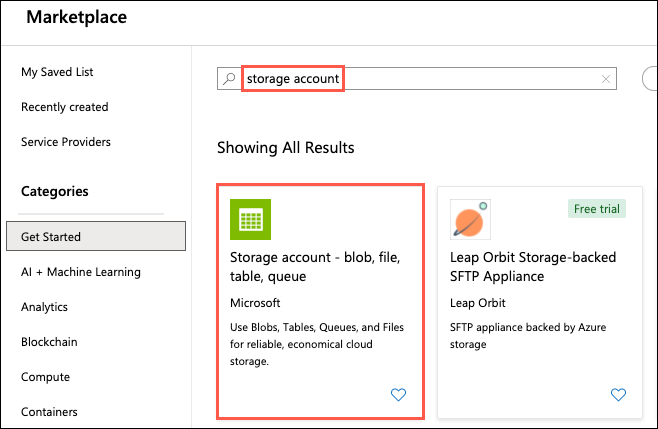

3. On the Create storage account **Basics** tab, enter the following:

   **Project Details**:

   - **Subscription**: Select the subscription you are using for this hands-on lab.
   - **Resource Group**: Select the hands-on-lab-SUFFIX resource group from the list of existing resource groups.

   **Instance Details**:

   - **Storage account name**: Enter datalakeSUFFIX.
   - **Location**: Select the location you are using for resources in this hands-on lab.
   - **Performance**: Choose **Standard**.
   - **Account kind**: Select **StorageV2 (general purpose v2)**.
   - **Replication**: Select **Locally-redundant storage (LRS)**.

   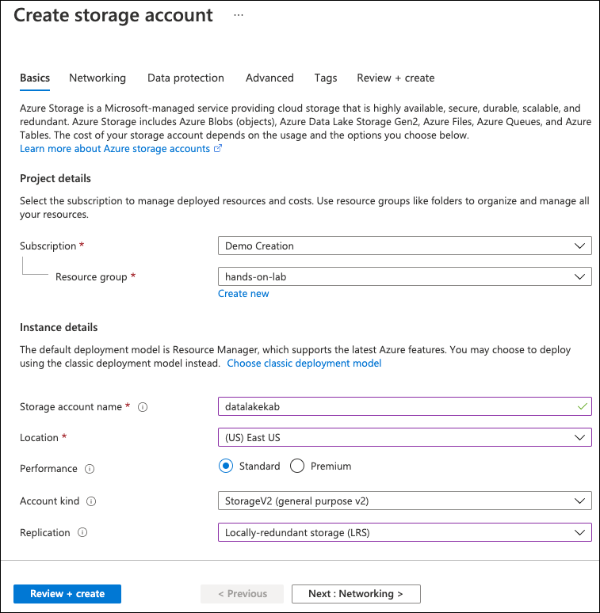

4. Next, select the **Advanced** tab.

   

5. On the Advanced tab, select **Enabled** from the **Hierarchical namespace** setting under Data Lake Storage Gen2.

   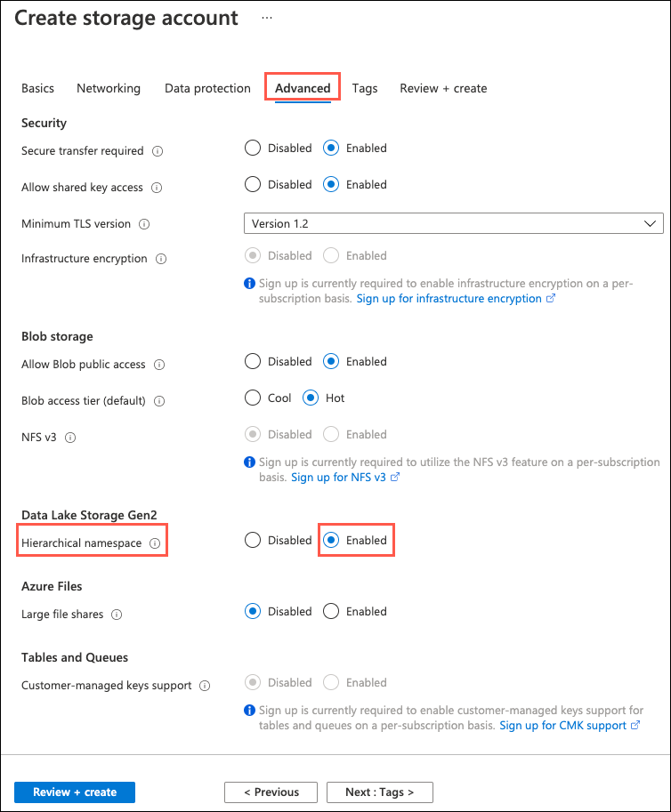

6. Select **Review + create**.

7. On the **Review + create** blade, ensure the Validation passed message is displayed and then select **Create**.

8. After the storage account has completed provisioning, open the storage account by selecting **Go to resource**.

    

9. On the **Storage account** blade, select **Containers** under **Data Lake Storage** in the left-hand navigation menu and then select the **+ Container** button to add a new container.

    

10. In the New container dialog, enter **images** into the **Name** field, choose **Private (no anonymous access)** for the public access level, then select **Create** to save the container.

    

11. Repeat step 10 to create another container named **export**.

    

12. Next, select **Access Keys**, under Settings in the left-hand navigation menu. Then on the **Access keys** blade, select **Show keys** and then select the **Click to copy** button for the **key1 connection string** value.

    

13. Paste the value into a text editor, such as Notepad, for reference in the Key Vault steps below.

## Task 2: Provision the TollBooth Function App

1. In the [Azure portal](https://portal.azure.com/), select the **Show portal menu** icon and then select **+Create a resource** from the menu.

    

2. Enter "function app" into the **Search the marketplace** box and select **Function App** from the results.

    

3. On the **Function App** blade, select **Create**.

4. On the **Create Function App** blade, enter the following:

   **Project Details**:

   - **Subscription**: Select the subscription you are using for this hands-on lab.
   - **Resource Group**: Select the hands-on-lab-SUFFIX resource group from the list of existing resource groups.

   **Instance Details**:

   - **Function App name:** Enter a globally unique name, such as "TollBoothFunctions-SUFFIX".
   - **Publish:** Select Code.
   - **Runtime Stack** Select .NET.
   - **Version**: Choose 3.1.
   - **Region:** Select the region you have been using for resources in this hands-on lab.

   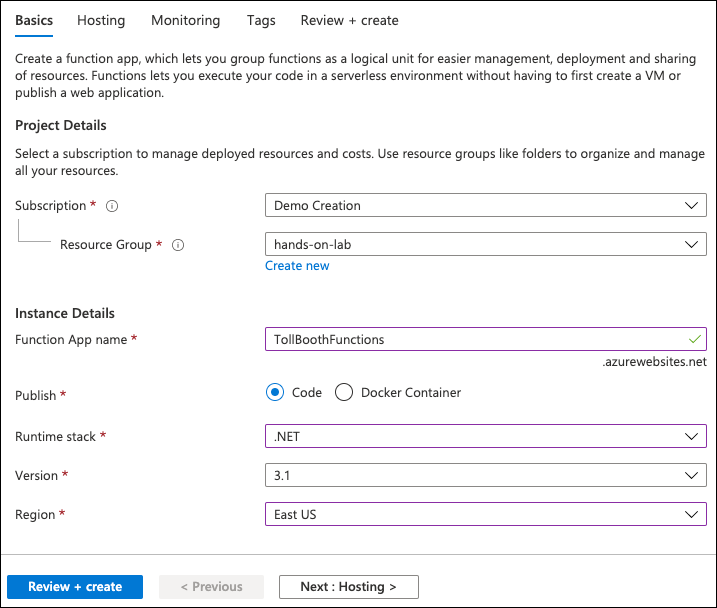

5. Select **Next: Hosting**.

6. On the Hosting tab, set the following configuration:

   - **Storage account:** Select the **datalakeSUFFIX** storage account you created in Task 1 above.
   - **Operating System**: Select Windows.
   - **Plan type:** Choose Consumption (Serverless).

   

7. Select **Next: Monitoring**, and on the Monitoring tab, enter the following:

   - **Enable Application Insights**: Select Yes.
   - **Application Insights**: Select Create new.

   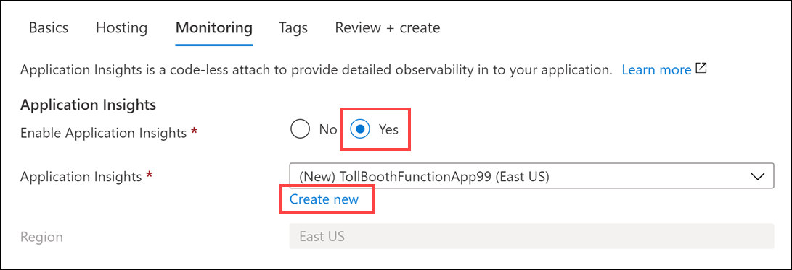

8. In the **Create new Application Insights** dialog, provide the following information, then select **OK**:

   - **Name**: Enter a globally unique value, similar to **appinsights-SUFFIX** (ensure the green checkmark appears).
   - **Location**: Select the same Azure region you selected for your Function App.

    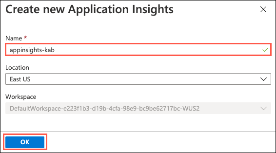

9. Select **Review + create**.

   

10. Select **Create** to provision the new Function App.

11. When the function app provisioning completes, navigate to it in the Azure portal by opening the **hands-on-lab-SUFFIX** resource group and then select the Azure Function App resource whose name begins with **TollBoothFunctions**.

    > For your Function App to be able to access Key Vault to read the secrets, you must [create a system-assigned managed identity](https://docs.microsoft.com/azure/app-service/overview-managed-identity#adding-a-system-assigned-identity) for the Function App, and [create an access policy in Key Vault](https://docs.microsoft.com/azure/key-vault/key-vault-secure-your-key-vault#key-vault-access-policies) for the application identity.

    

12. On the Function App blade, select **Identity** in the left-hand navigation menu, and within the **System assigned** tab, switch **Status** to **On** and select **Save**.

    

## Task 3: Provision the Events Function App

1. In the [Azure portal](https://portal.azure.com/), select the **Show portal menu** icon and then select **+Create a resource** from the menu.

    

2. Enter "function app" into the **Search the marketplace** box and select **Function App** from the results.

    

3. On the **Function App** blade, select **Create**.

4. On the **Create Function App** blade, enter the following:

   **Project Details**:

   - **Subscription**: Select the subscription you are using for this hands-on lab.
   - **Resource Group**: Select the hands-on-lab-SUFFIX resource group from the list of existing resource groups.

   **Instance Details**:

   - **Function App name:** Enter a globally unique name, such as "TollBoothEvents-SUFFIX".
   - **Publish:** Select Code.
   - **Runtime Stack** Select Node.js.
   - **Version**: Choose 14 LTS.
   - **Region:** Select the region you have been using for resources in this hands-on lab.

   

5. Select **Next: Hosting**.

6. On the Hosting tab, set the following configuration:

   - **Storage account:** Select the **datalakeSUFFIX** storage account you created in Task 1 above.
   - **Operating System**: Select Windows.
   - **Plan type:** Choose Consumption (Serverless).

   

7. Select **Next: Monitoring**, and on the Monitoring tab, enter the following:

   - **Enable Application Insights**: Select Yes.
   - **Application Insights**: Select the Application Insights instance you created earlier when provisioning the TollBoothFunctions Function App.

   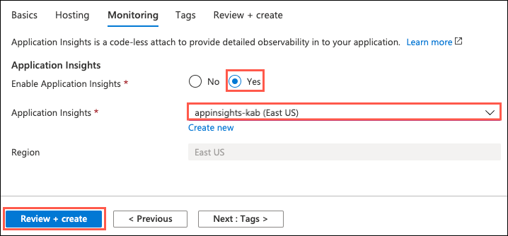

8. Select **Review + create** and then select **Create** to provision the Function App.

## Task 4: Provision an Event Grid topic

1. In the [Azure portal](https://portal.azure.com/), select the **Show portal menu** icon and then select **+Create a resource** from the menu.

   

2. Enter "event grid topic" into the **Search the marketplace** box and select **Event Grid Topic** from the results.

   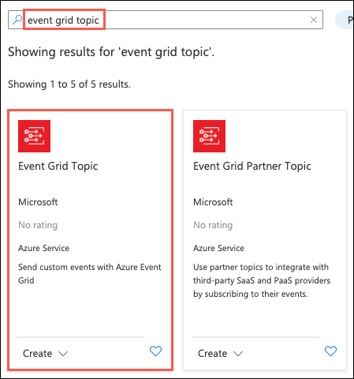

3. On the **Event Grid Topic** blade, select **Create**.

4. On the **Create Topic** blade, specify the following configuration options:

   **Project Details**:

   - **Subscription**: Select the subscription you are using for this hands-on lab.
   - **Resource Group**: Select the hands-on-lab-SUFFIX resource group from the list of existing resource groups.

   **Instance Details**:

   - **Name:** Enter a globally unique value, such as **eventgridtopic-SUFFIX** (ensure the green checkmark appears).
   - **Location:** Select the region you have been using for resources in this hands-on lab.

   

5. Select **Review + Create**, then select **Create** in the screen that follows.

6. After the Event Grid topic has completed provisioning, open the account by opening the **hands-on-lab-SUFFIX** resource group and then selecting the **Event Grid Topic** resource from the list of available services.

7. On the Event Grid Topic blade, select **Overview** in the left-hand navigation menu and then copy the **Topic Endpoint** value and paste the value into a text editor, such as Notepad, for later reference.

   

8. Next, select **Access Keys** under Settings in the left-hand navigation menu on the Event Grid Topic blade.

9. Within the **Access Keys** blade, copy the **Key 1** value and paste it into a text editor, such as Notepad, for later reference.

   

## Task 5: Provision and configure an Azure Cosmos DB account

1. In the [Azure portal](https://portal.azure.com/), select the **Show portal menu** icon and then select **+Create a resource** from the menu.

   

2. On the **New** screen, select **Databases** then select **Azure Cosmos DB**.

   

3. On the **Create new Azure Cosmos DB** **account** blade, specify the following configuration options:

   **Project Details**:

   - **Subscription**: Select the subscription you are using for this hands-on lab.
   - **Resource Group**: Select the hands-on-lab-SUFFIX resource group from the list of existing resource groups.

   **Instance Details**:

   - **Account Name:** Enter a globally unique value, such as **cosmosdb-SUFFIX** (ensure the green check mark appears).
   - **API**: Select the **Core (SQL)** API.
   - **Location:** Select the region you have been using for resources in this hands-on lab.
   - **Capacity mode**: Select **Provisioned throughput**.
   - **Apply Free Tier Discount**: Select **Do Not Apply**.
   - **Account Type**: Select **Production**.
   - **Geo-Redundancy**: Choose **Disable**.
   - **Multi-region writes**: Select **Disable**.

   

4. Select **Review + create**, then select **Create**.

5. After the Azure Cosmos DB account has completed provisioning, open the account by opening the **hands-on-lab-SUFFIX** resource group and then selecting the **Azure Cosmos DB** resource from the list of available services in the resource group.

6. On the Cosmos DB blade, select **Data Explorer** in the left-hand navigation menu and then select **New Container**.

   

7. On the **Add Container** blade, specify the following configuration options:

   - **Database Id**: Choose **Create new** and enter **LicensePlates** for the name.
   - **Container Id**: Enter **Processed**.
   - **Partition key**: Enter **/licensePlateText**.
   - **Throughput**: Select **Autoscale** and enter **4000** into the **Max RU/s** box.

    

8. Select **OK**.

9. Select **New Container** again on the Data Explorer blade to add another container.

10. On the **Add Container** blade, specify the following configuration options:

    - **Database Id**: Choose **Use existing** and select the **LicensePlates** database Id.
    - **Container Id**: Enter **NeedsManualReview**.
    - **Partition key**: Enter **/fileName**.
    - **Throughput**: Select **Autoscale** and enter **4000** into the **Max RU/s** box.

    

11. Select **OK**.

12. Select **Keys** under Settings in the left-hand navigation menu on the Cosmos DB blade.

13. Underneath the **Read-write Keys** tab within the Keys blade, copy the **URI** and **Primary Key** values.

    

14. Paste the values into a text editor, such as Notepad, for later reference.

## Task 6: Provision the Computer Vision API service

1. In the [Azure portal](https://portal.azure.com/), select the **Show portal menu** icon and then select **+Create a resource** from the menu.

   

2. Enter "computer vision" into the **Search the marketplace** box, select **Computer Vision** from the results, and then select the **Create** button on the **Computer Vision** blade.

3. On the **Create Computer Vision** blade, specify the following configuration options:

   **Project Details**:

   - **Subscription**: Select the subscription you are using for this hands-on lab.
   - **Resource Group**: Select the hands-on-lab-SUFFIX resource group from the list of existing resource groups.

   **Instance Details**:

   - **Region:** Select the region you have been using for resources in this hands-on lab.
   - **Name**: Enter a globally unique value, such as **computervision-SUFFIX** (ensure the green checkmark appears).
   - **Pricing tier**: Select **Standard S1 (10 Class per second)**.

   

4. Select **Review + create** and then select **Create**.

5. After the Computer Vision service has completed provisioning, open the service by opening the **hands-on-lab-SUFFIX** resource group and then selecting the **Computer Vision** Cognitive Service resource from the list of available services in the resource group.

6. Under Resource Management in the left-hand navigation menu, select **Keys and Endpoint**.

7. Within the **Keys and Endpoint** blade, copy the **Endpoint** and **KEY 1** values.

    

8. Paste the values into a text editor, such as Notepad, for later reference.

## Task 7: Create a Logic App

1. In the [Azure portal](https://portal.azure.com/), select the **Show portal menu** icon and then select **+Create a resource** from the menu.

   

2. Enter "logic app" into the **Search the marketplace** box and select **Logic App** from the results.

   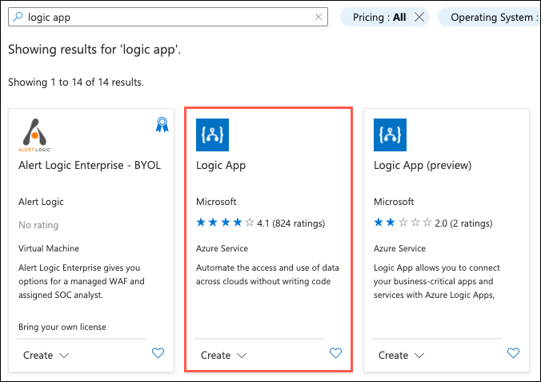

3. Select the **Create** button on the **Logic App** blade.

4. On the **Create a logic app** blade Basics tab, specify the following configuration options:

   **Project Details**:

   - **Subscription**: Select the subscription you are using for this hands-on lab.
   - **Resource Group**: Select the hands-on-lab-SUFFIX resource group from the list of existing resource groups.

   **Instance Details**:

   - **Logic app name**: Enter a globally unique value, such as **logicapp-SUFFIX** (ensure the green check mark appears).
   - **Region:** Select the region you have been using for resources in this hands-on lab.
   - **Associate with integration service environment**: Leave unchecked.
   - **Enable log analysis**: Leave unchecked.

   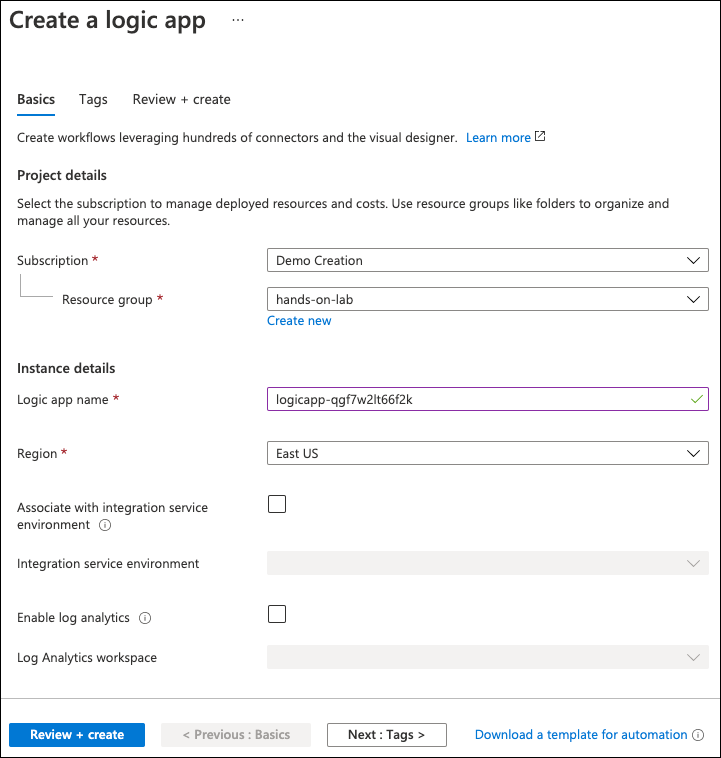

5. Select **Review + create**, then select **Create**.

## Task 8: Provision Azure Key Vault

1. In the [Azure portal](https://portal.azure.com/), select the **Show portal menu** icon and then select **+Create a resource** from the menu.

   

2. Enter "key vault" into the **Search the marketplace** box and select **Key Vault** from the results.

   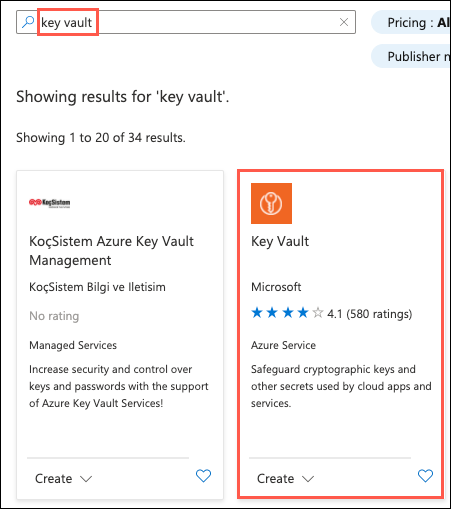

3. Select the **Create** button on the **Key Vault** blade.

4. On the **Create key vault** blade Basics tab, specify the following configuration options:

   **Project Details**:

   - **Subscription**: Select the subscription you are using for this hands-on lab.
   - **Resource Group**: Select the hands-on-lab-SUFFIX resource group from the list of existing resource groups.

   **Instance Details**:

   - **Key vault name**: Enter a globally unique value, such as **keyvault-SUFFIX** (ensure the green check mark appears).
   - **Region:** Select the region you have been using for resources in this hands-on lab.
   - **Pricing tier**: Select **Standard**.
   - **Days to retain deleted vaults**: Leave at 90.
   - **Purge protection**: Select the **Disable** option.

   

5. Select **Next: Access policy**.

6. On the Access policy tab, select **Add Access Policy**.

   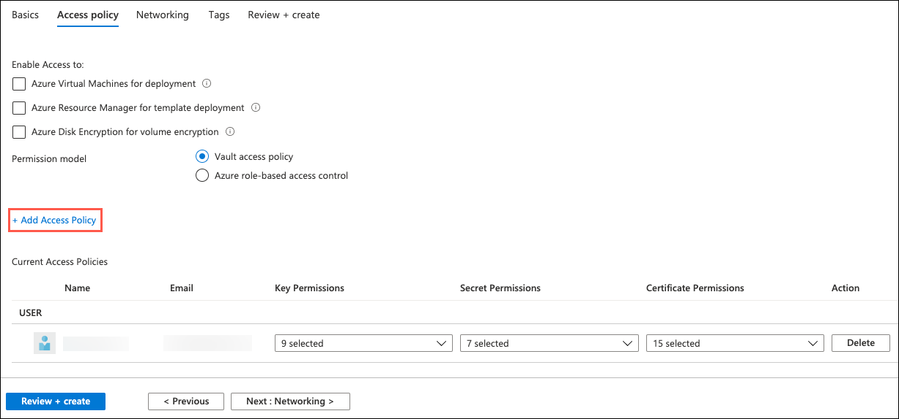

7. On the Add access policy dialog, enter the following:

   - **Secret permissions**: Select **Get** from the list of available permissions.
   - **Select principal**: Select *None selected** and in the dialog, enter **TollBoothFunctions** into the search box, select the TollBoothFunctions Function App's managed service identity from the results and then select **Select**.

   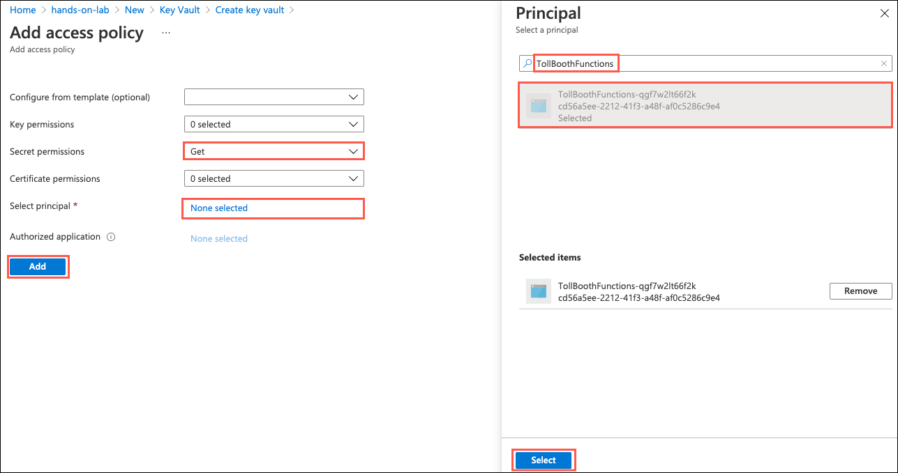

8. Select **Add** to add the new access policy.

9. Select **Review + create**, then select **Create**.

10. After the deployment completes, select **Go to resource** in the deployment complete notification.

    

11. Select **Secrets** under Settings in the left-hand navigation menu.

12. Select **Generate/Import** to add a new key.

    

13. Using the key values you copied into a text editor, such as Notepad, in the tasks above, use the table below for the name-value pairs to use when creating the secrets. You only need to populate the **Name** and **Value** fields for each secret and leave the other fields at their default values.

    |                          |                                     |
    | ------------------------ | ----------------------------------- |
    | **Name**                 | **Value**                           |
    | computerVisionApiKey     | Computer Vision API key             |
    | cosmosDBAuthorizationKey | Cosmos DB Primary Key               |
    | dataLakeConnectionString | Data Lake storage connection string |
    | eventGridTopicKey        | Event Grid Topic access key         |

14. When you are finished creating the secrets, your list should look similar to the following:

    

## Task 9: Retrieve the URI for each secret

1. Open your Key Vault instance in the portal.

2. Still on the **Secrets** page in Key Vault, select the `computerVisionApiKey` secret.

   

3. On the computerVisionApiKey blade, select the **Current Version** of the secret.

    

4. On the secret version blade, copy the **Secret Identifier** value by selecting the **Copy to clipboard** button.

    

5. Paste the secret identifier value into a text editor, such as Notepad, for later reference.

6. Close the `computerVisionApiKey` blades and return to the **Secrets** page of your Key Vault.

7. Repeat steps 2 through 6 above for the other three secrets listed.

8. When you are done copying and pasting the secret identifier values, you should have a list similar to the following in your text editor document:

   ```text
   @Microsoft.KeyVault(SecretUri=https://tollboothvault.vault.azure.net/secrets/computerVisionApiKey/ce228a43f40140dd8a9ffb9a25d042ee)
   @Microsoft.KeyVault(SecretUri=https://tollboothvault.vault.azure.net/secrets/cosmosDBAuthorizationKey/1f9a0d16ad22409b85970b3c794a218c)
   @Microsoft.KeyVault(SecretUri=https://tollboothvault.vault.azure.net/secrets/dataLakeConnectionString/771aa40adac64af0b2aefbd741bd46ef)
   @Microsoft.KeyVault(SecretUri=https://tollboothvault.vault.azure.net/secrets/eventGridTopicKey/e310bcd71a72489f89b6112234fed815)
   ```

## Task 10: Configure application settings for the TollBoothFunctions Function App

1. Navigate to the **TollBoothFunctions** Function App resource in the Azure portal by opening the **hands-on-lab-SUFFIX** resource group and then select the Azure Function App resource whose name begins with **TollBoothFunctions**.

   

2. On the Function App blade, select **Configuration** in the left-hand navigation menu.

    

3. Scroll to the **Application settings** section. Use the **+ New application setting** link to create the following additional key-value pairs (the key names must exactly match those found in the table below). **Be sure to remove the curly braces (`{}`)**.

    |                          |           |
    | ------------------------ | --------- |
    | **Application Key**      | **Value** |
    | computerVisionApiKey     | Enter `@Microsoft.KeyVault(SecretUri={referenceString})`, where `{referenceString}` is the URI for the **computerVisionApiKey** Key Vault secret |
    | computerVisionApiUrl     | Computer Vision API endpoint you copied earlier with **vision/v3.0/ocr** appended to the end. Example: `https://eastus.api.cognitive.microsoft.com/vision/v3.0/ocr` |
    | cosmosDBAuthorizationKey | Enter `@Microsoft.KeyVault(SecretUri={referenceString})`, where `{referenceString}` is the URI for the **cosmosDBAuthorizationKey** Key Vault secret |
    | cosmosDBCollectionId     | Cosmos DB processed collection id (**Processed**) |
    | cosmosDBDatabaseId       | Cosmos DB database id (**LicensePlates**) |
    | cosmosDBEndpointUrl      | Cosmos DB URI |
    | dataLakeConnection | Enter `@Microsoft.KeyVault(SecretUri={referenceString})`, where `{referenceString}` is the URI for the **dataLakeConnectionString** Key Vault secret |
    | eventGridTopicEndpoint   | Event Grid Topic endpoint |
    | eventGridTopicKey        | Enter `@Microsoft.KeyVault(SecretUri={referenceString})`, where `{referenceString}` is the URI for the **eventGridTopicKey** Key Vault secret |
    | exportCsvContainerName   | Data lake CSV export container name (**export**) |

    

4. Select **Save** on the Configuration toolbar to save the application settings changes.

## Task 11: Set up a development virtual machine

In this task, you provision a virtual machine (VM) in Azure. The VM image used has the latest version of Visual Studio Community 2019 installed.

1. In the [Azure portal](https://portal.azure.com/), select the **Show portal menu** icon and then select **+Create a resource** from the menu.

   

2. Enter "visual studio 2019" into the Search the Marketplace box and then select **Visual Studio 2019 Latest** from the results.

   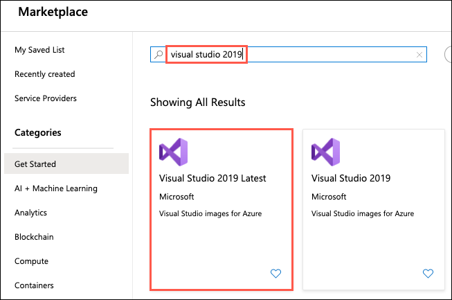

3. On the Visual Studio 2019 Latest blade, select **Visual Studio 2019 Community (latest release) on Windows Server 2019 (x64)** from the Select a software plan drop-down list, and then select **Create**.

   

4. On the Create a virtual machine **Basics** tab, set the following configuration:

   - Project Details:

     - **Subscription**: Select the subscription you are using for this hands-on lab.
     - **Resource Group**: Select the **hands-on-lab-SUFFIX** resource group from the list of existing resource groups.

   - Instance Details:

     - **Virtual machine name**: Enter LabVM.
     - **Region**: Select the region you are using for resources in this hands-on lab.
     - **Availability options**: Select no infrastructure redundancy required.
     - **Image**: Leave Visual Studio 2019 Community (latest release) on Windows Server 2019 (x64) selected.
     - **Azure Spot instance**: Select No.
     - **Size**: Accept the default size of Standard_D4s_v3.

   - Administrator Account:

     - **Username**: Enter **demouser**.
     - **Password**: Enter **Password.1!!**

   - Inbound Port Rules:

     - **Public inbound ports**: Choose Allow selected ports.
     - **Select inbound ports**: Select RDP (3389) in the list.

   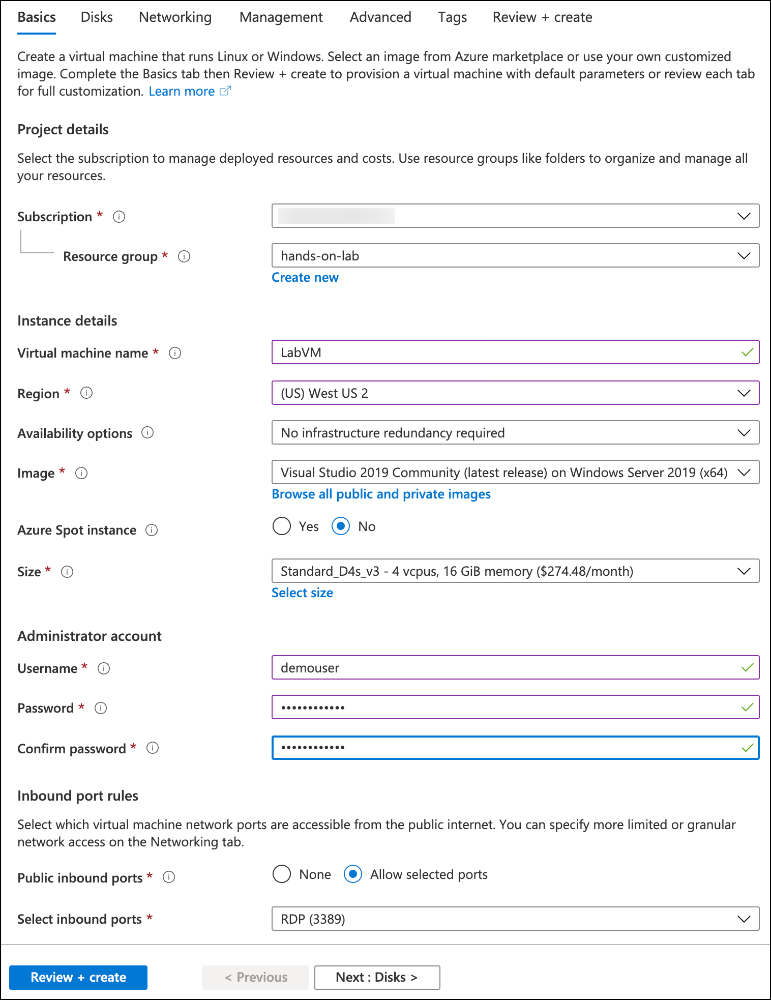

   > **Note**: Default settings are used for the remaining tabs so that they can be skipped.

5. Select **Review + create** to validate the configuration.

6. On the **Review + create** tab, ensure the Validation passed message is displayed, and then select **Create** to provision the virtual machine.

   

7. It takes approximately 5 minutes for the VM to finish provisioning.

## Task 12: Connect to the Lab VM

In this task, you create an RDP connection to your Lab virtual machine (VM).

1. In the [Azure portal](https://portal.azure.com), select **Resource groups** from the Azure services list.

   

2. Select the **hands-on-lab-SUFFIX** resource group from the list.

   

3. In the list of resources within your resource group, select the **LabVM Virtual machine** resource.

   

4. On your LabVM blade, select **Connect** and **RDP** from the top menu.

   

5. On the Connect to virtual machine blade, select **Download RDP File**, then open the downloaded RDP file.

   

6. Select **Connect** on the Remote Desktop Connection dialog.

   

7. Enter the following credentials when prompted, and then select **OK**:

   - **Username**: demouser
   - **Password**: Password.1!!

   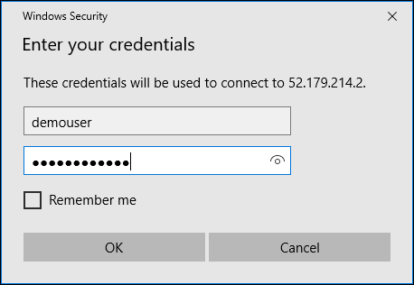

8. Select **Yes** to connect if prompted that the remote computer's identity cannot be verified.

   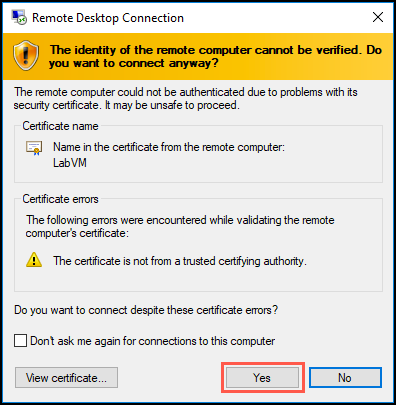

## Task 13: Disable Internet Explorer Enhanced Security

In this task, you disable Internet Explorer Enhanced Security Configuration (IE ESC) on the LabVM.

> > **Note**: Sometimes this Visual Studio 2019 Latest image has IE ESC disabled already, and sometimes it does not.

1. Once logged in, launch the **Server Manager**. This should start automatically, but you can access it via the Start menu if it does not.

2. Select **Local Server**, then select **On** next to **IE Enhanced Security Configuration**.

    

3. In the Internet Explorer Enhanced Security Configuration dialog, select **Off** under both Administrators and Users, and then select **OK**.

    

4. You can close the Server Manager but leave the connection to the LabVM open for the next task.

## Task 14: Install required software on the LabVM

In this task, you configure the LabVM with the required software and downloads. First, you download and install the Microsoft Edge web browser. Next, you download a copy of the Visual Studio starter solution and unzip it into a folder named `C:\ServerlessMCW`.

> **Note**: Some aspects of this lab require using the new Microsoft Edge (Chromium edition) browser. You may find yourself blocked if using Internet Explorer later in the lab, as Internet Explorer is not supported for some specific activities.

1. To install Microsoft Edge, launch Internet Explorer on the VM and download [Microsoft Edge](https://msedge.sf.dl.delivery.mp.microsoft.com/filestreamingservice/files/0a4291f0-226e-4d0a-a702-7aa901f20ff4/MicrosoftEdgeEnterpriseX64.msi).

2. Run the downloaded installer and follow the setup instruction.

3. Next, [download a copy of the Serverless Architecture MCW GitHub repo](https://github.com/microsoft/MCW-Serverless-architecture/archive/master.zip).

4. Extract the download ZIP file to `C:\ServerlessMCW`.

   
